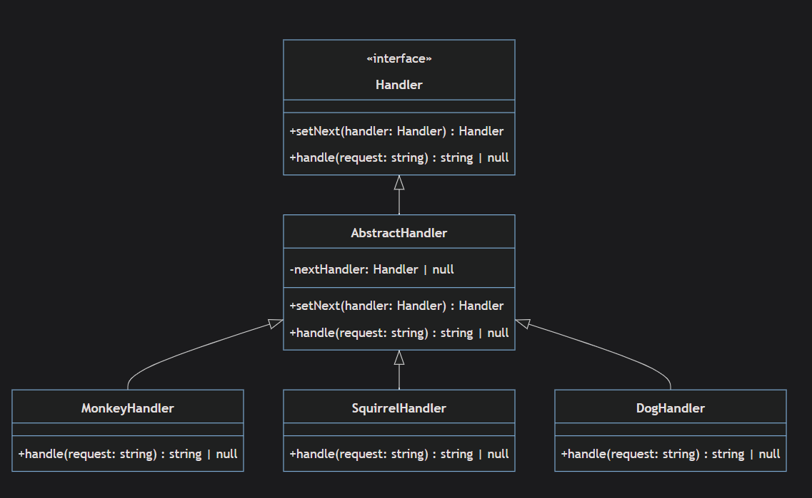
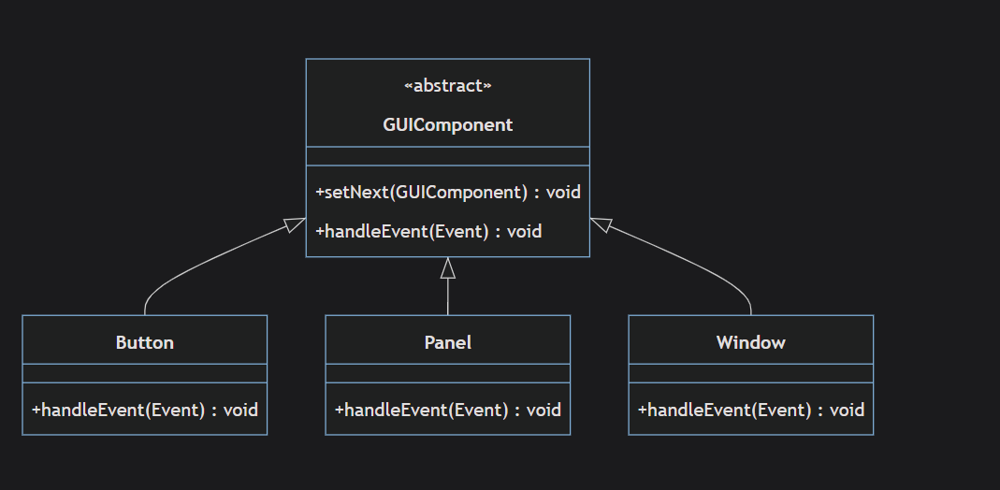
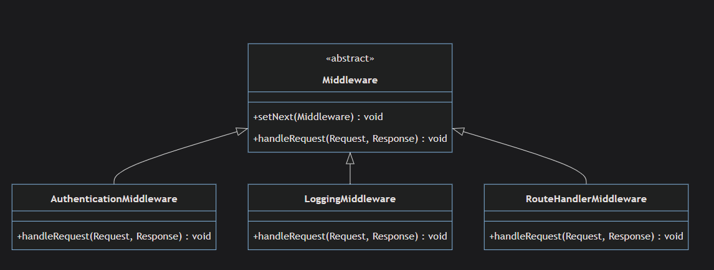
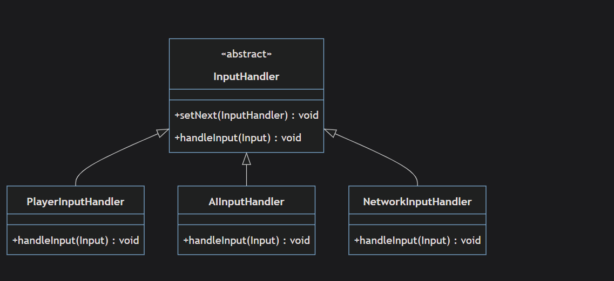
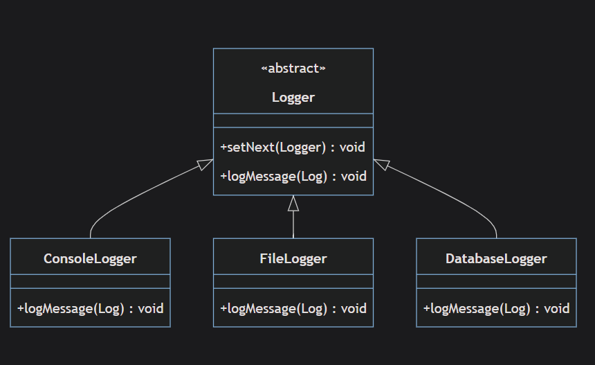

# Chain Of Responsibility

`Chain of Responsibility is behavioral design pattern that allows a request to be processed throw a sequential chained objects.`

## Components



1- **Handler**: is an interface that with two methods setNext and handle.

2- **AbstractHandler**: is an abstract class that implements _Handler_. It has a private member _nextHandler_ and provides an implementation for the _setNext_ and _handle_ methods.

3- _MonkeyHandler_, _SquirrelHandler_, and _DogHandler_ are classes that extend _AbstractHandler_ and provide their own implementation of the _handle_ method.

## When To Use

`The Chain of Responsibility pattern is generally applicable when you have multiple objects that can potentially handle a request but there exact handler isn't predetermined rather than it is determined at run time`

for example in `after.ts` we could assume that the foods array is only provided at run time so we prepared a set of chained handlers to interact with this array of foods.

1- **Coupling**: it means when there high coupling between client code and handlers.

for example in `after.ts` the code before applying chain responsibility , the client code could looks something like this.

```typeScript
// ❌ High Coupling - Client knows about ALL handlers
class FoodRequestSystem {
  // ❌ these classes are not chaining
  private dogHandler = new DogHandler();
  private monkeyHandler = new MonkeyHandler();
  private squirrelHandler = new SquirrelHandler();

  processFood(food: string): string {
    // ❌ Client must know which handler to call for which food
    if (food === "MeatBall") {
      return this.dogHandler.handle(food);
    } else if (food === "Banana") {
      return this.monkeyHandler.handle(food);
    } else if (food === "Nut") {
      return this.squirrelHandler.handle(food);
    }

    return "No one wants this food";
  }

  // ❌ If you want to add CatHandler, you must modify this class
  addCatHandler() {
    this.catHandler = new CatHandler();  // New dependency
    // Must also modify processFood method with new if/else
  }
}

// ❌ Client is tightly coupled to specific handlers
const system = new FoodRequestSystem();
system.processFood("Banana");  // Client knows about system internals
```

with our code in `after.ts` , we got the ability to decouple the client code totally even if the chain was builded from the client

```typeScript
//chain is builded on client , but this not an issue
const monkey = new MonkeyHandler();
const dog = new DogHandler();
const squirrel = new SquirrelHandler();

monkey.setNext(dog).setNext(squirrel);
clientCode(monkey);

//refactoring this


class ChainFactory {
  static createAnimalChain(): Handler {
    // ✅ Client doesn't need to know about specific handlers
    const monkey = new MonkeyHandler();
    const dog = new DogHandler();
    const squirrel = new SquirrelHandler();

    return monkey.setNext(dog).setNext(squirrel);
  }

  static createPetChain(): Handler {
    const cat = new CatHandler();
    const dog = new DogHandler();

    return cat.setNext(dog);
  }
}

// ✅ Fully decoupled client
const chain = ChainFactory.createAnimalChain();  // Client doesn't know internals
clientCode(chain);

```

2- **Multiple Conditionals**: this is an extend to the previous point , from next part of the code

```typeScript
 if (food === "MeatBall") {
      return this.dogHandler.handle(food);
    } else if (food === "Banana") {
      return this.monkeyHandler.handle(food);
    } else if (food === "Nut") {
      return this.squirrelHandler.handle(food);
    }

```

we needed to determine kind of food to determine how to process a certain request.
This is sometimes referred to as "Conditional Complexity" and using the Chain of Responsibility pattern can help distribute these conditionals across different classes, each handling its own logic.

3- **Varying Processing Logic**:what does it mean that for example in `after.ts` the logic differs in _MonkeyHandler_ class , _DogHandler_ class etc , with chain responsibility adding new logic for example _CowHandler_ is just as easy

4- **Uncertain Processing Path**: It means when you don't know what handlers you will be using it only determines at runtime , this where responsibility chain shines

5- **Sequential Processing Required**:It means the request needs to be processed sequentially by multiple entities

6- **Code Duplication**:You notice that similar pieces of code are scattered in different parts of your codebase and each piece is doing a part of the processing.
for example in `after.ts` the code before applying design pattern.

```typeScript
class FoodProcessor {
  processFood(food: string, eater: string): string {
    if (eater === "dog") {
      // ❌ Duplicated logging and validation
      console.log(`Processing ${food} for ${eater}`);
      if (!food) return "No food provided";
      if (food === "MeatBall") return `Dog: I'll eat the ${food}`;
      console.log(`${eater} doesn't want ${food}`);
      return null;
    }

    if (eater === "monkey") {
      // ❌ SAME logging and validation duplicated
      console.log(`Processing ${food} for ${eater}`);
      if (!food) return "No food provided";
      if (food === "Banana") return `Monkey: I'll eat the ${food}`;
      console.log(`${eater} doesn't want ${food}`);
      return null;
    }

    // ❌ More duplication for each new animal
  }
}

//after applying the design pattern

abstract class AnimalHandler implements Handler {
  // ✅ Common logic in base class - no duplication
  protected logProcessing(food: string): void {
    console.log(`Processing ${food}`);
  }

  protected validateFood(food: string): boolean {
    return food && food.length > 0;
  }

  protected logRejection(food: string): void {
    console.log(`I don't want ${food}`);
  }
}

class DogHandler extends AnimalHandler {
  handle(food: string): string | null {
    this.logProcessing(food); // ✅ Reuse common logic

    if (!this.validateFood(food)) return "No food provided"; // ✅ Reuse validation

    if (food === "MeatBall") {
      return `Dog: I'll eat the ${food}`;
    }

    this.logRejection(food); // ✅ Reuse common logic
    return super.handle(food);
  }
}
```

`Note`: "_this_ " is calling the method from the same class this means if it was overridden it will call it from the same class.
"_super_" it will call the method from the parent directly
_for above case_ no difference between "_this_" and "_super_"

`While these "code smells" may suggest that Chain of Responsibility could be applicable, they don't necessarily mean it is the best or only solution. Other design patterns could also be appropriate depending on the specific context. Use your best judgement when deciding to apply a design pattern.`

[Cloudaffle](https://www.udemy.com/course/design-patterns-using-typescript/learn/lecture/39501280?start=120#overview)

## Advantages

1- **Decoupling Senders and Receivers**: for example in `after.ts` the sender issues a request without knowing which object in the chain will handle it , also in `OrderProcessing.ts` the client does not know about the concrete handler , in other words it does apply handlers to process the object but it does not know it's logic.

2- **Dynamic chain configuration**: you can set chain of responsibilities at run time , add/remove easily.

3- **Sequential processing**: as we saw in `OrderProcessing.ts`

## DisAdvantages

1- **Overhead of Handling Requests**: Due to many classes and interfaces.

2-**Debugging and Maintenance can be Tricky**:Since the request can pass through several handlers and the chain could be configured at runtime, it might become difficult to trace through the code in order to understand what's happening, or to diagnose issues.

`those first two points are comes with any abstraction of any design pattern , because we're moving form procedural way of thinking.`
_Cloudaffle_

3- **Improper or No Handling**:If the chain of handlers is not configured correctly, a request might not get handled at all or it might be processed in wrong way.

4- **Adding Too Many Responsibilities**:High complexity and potential violation of Single Responsibility Principle.
Violating SRP can happen within teams rather than single developer , as controlling the class single responsibility can be difficult since for example in `OrderProcessing.ts` a developer of a team might not aware how this design pattern works and have access to "_Order_" object in "_DiscountHandler()_" and can be ending making that class do more than it should be doing , so strictness in adhering single responsibility is required in this design pattern.
_info from quiz_: long chain of responsibilities will lead to performance issue.

5- **Dependency on the Order of Handlers** :Incorrect order can lead to unexpected behaviors.
This can be seen in client code in `OrderProcessing.ts` .

```typeScript
//original order
validationHandler
  .setNext(discountHandler)
  .setNext(paymentHandler)
  .setNext(shipHandler);

  //changed order
  validationHandler
  .setNext(shipHandler);
  .setNext(discountHandler)
  .setNext(paymentHandler)
  //this order is total wrong order , where output is still same , but the process is totally wrong , order is shipped without being processed from other handlers
```

## Use Cases

1- **Event Propagation in Graphical User Interfaces (GUIs)**
`Many GUI frameworks use a form of the Chain of Responsibility pattern to propagate events. When a user interacts with a graphical component (like clicking a button), an event is generated. This event is then propagated up through the nested components (from the button to its parent panel, to the parent window, and so on) until it's handled. This allows individual components to either handle the event, or ignore it and allow a parent component to handle it. This use of the Chain of Responsibility pattern allows for flexible and dynamic event handling in GUIs.`
**cloudaffle**


2- **Middleware in Web Development Frameworks**
these middlewares are handle requests and process them and pass them to next handlers.


3- **Input/Event Handling in Game Development**:
`In game development, the Chain of Responsibility pattern can be used to handle user input or game events. This allows different game objects or systems to handle the input or event as needed. For example, a game might have a chain of input handlers, where each handler checks if the input is relevant to it (like a specific keystroke or mouse movement). If a handler can't handle the input, it passes it along to the next handler.`
**cloudaffale**


4- **Logging Frameworks**:
`Logging frameworks often use a form of the Chain of Responsibility pattern to propagate log messages. Loggers can be arranged in a hierarchy, and each logger can decide whether to handle a log message or to propagate it up the hierarchy. This allows for flexible and configurable logging, where each logger can be set to handle a certain level of log messages (like ERROR, WARNING, INFO, etc.) and to propagate other messages.`
**Cloudaffle**

