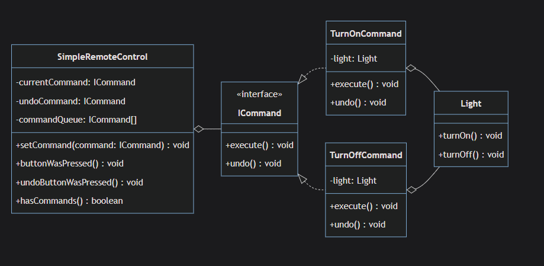
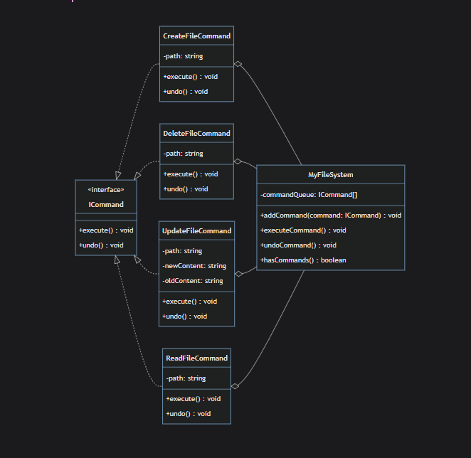
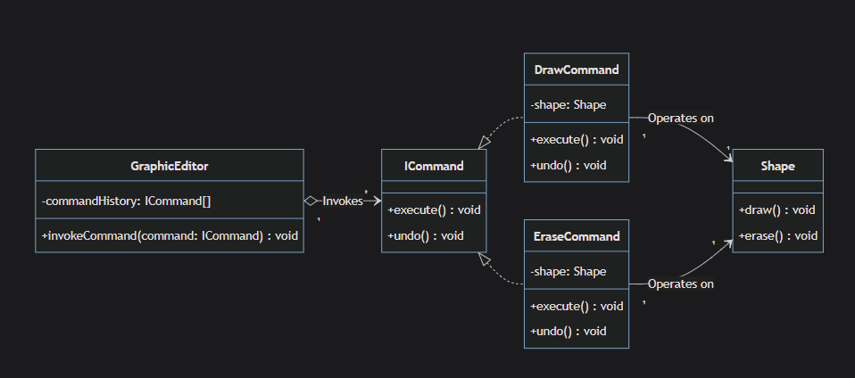
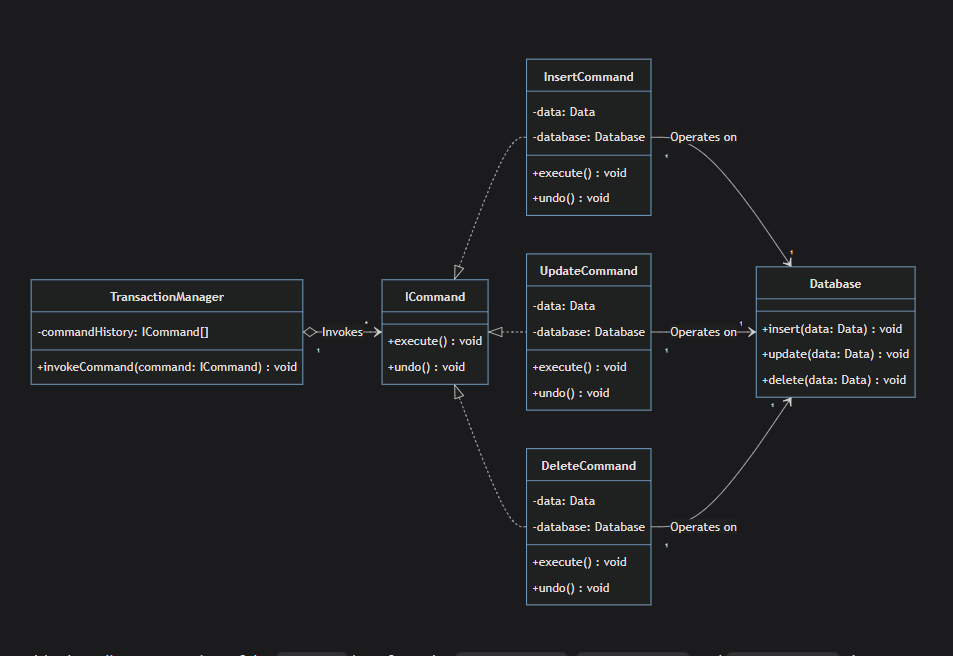
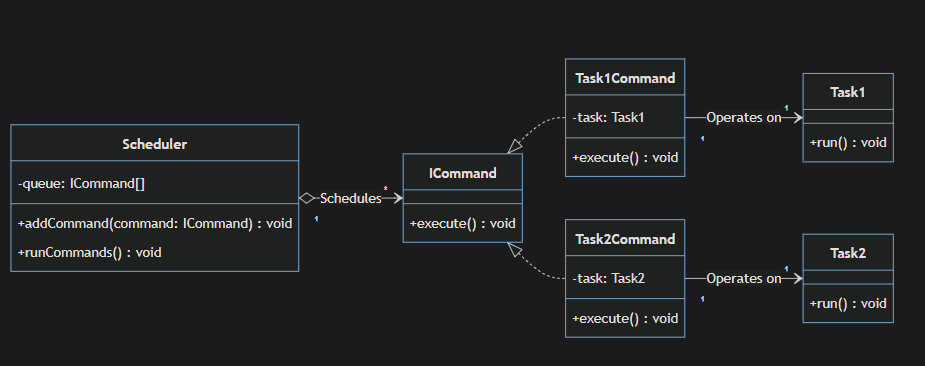

# Command

`Command is a behavioral design pattern that encapsulate methods into standalone objects. This transformation allows you to queue, delay object execution and support undoable operations`

## Note from the instructor

the command design pattern introduces a lot of complexity, there are a lot of interfaces , classes involved as each command encapsulated into different class so as the system grows the command design pattern became more complex.
So for simple operations, using command pattern might just be an overkill.
only if you have complex operations and each command does need to be encapsulated use this pattern

[Manik (Cloudaffle)](https://cloudaffle.com/series/behavioral-design-patterns/command-pattern-criticism/#overhead)

## Components

1- **Command**: _ICommand_ interface usually it has _do()_ and _undo()_ methods and implemented by all concrete command classes.
_An info form the quiz:_ The core idea behind undo functionality is to remember what actions have been performed so that they can be reverted in the correct order.

2- **Concrete Command**: class the implement _ICommand_ interface

3- **Receiver**: the methods that turns into classes that implements the _ICommand_ interface.
_An info form the quiz_: It execute the actual logic of the command

4- **Invoker**: the class that responsible for controlling the commands _addCommand()_ , _executeCommand()_ , _undoCommand()_ , _hasCommand()_.
_An info form the quiz:_ The main purpose of Invoker is to hold the command objects.

5- **Client**: The Client class in your code is the Client. It creates and configures the Concrete Command objects and the Receiver.

## Projects

1- `after.ts`
**Turn On/Off light**


2- `FileSystem.ts`


## Use Cases

1- **Complex Commands**: invoking more that one function to operate certain task , Command Design pattern can be helpful in such case

for example `after.ts` can be something like this

```typeScript
//Command Receiver
class Light {
  private brightness: number = 0;
  private isOn: boolean = false;

  public turnOn() {
    this.isOn = true;
    console.log("Turn On Light");
  }

  public turnOff() {
    this.isOn = false;
    this.brightness = 0;
    console.log("Turn Off Light");
  }

  public setBrightness(level: number) {
    this.brightness = level;
    console.log(`Set brightness to ${level}%`);
  }

  public getBrightness(): number {
    return this.brightness;
  }

  public isLightOn(): boolean {
    return this.isOn;
  }
}

// COMPLEX COMMAND 1: Movie Night Setup
class MovieNightCommand implements ICommand {
  private light: Light;
   // Store previous states for undo
  private previousLightState: { isOn: boolean; brightness: number } = { isOn: false, brightness: 0 };
   constructor(light: Light, fan: Fan, stereo: Stereo) {
    this.light = light;
   }
    execute(): void {
    console.log("🎬 Setting up Movie Night...");

    // Store current states before changing
    this.previousLightState = {
      isOn: this.light.isLightOn(),
      brightness: this.light.getBrightness()
    };
    this.previousFanSpeed = this.fan.getSpeed();
    this.previousStereoState = {
      isOn: this.stereo.isPlaying(),
      volume: this.stereo.getVolume()
    };

    // Execute complex sequence
    this.light.turnOn();
    this.light.setBrightness(20); // Dim lighting
    }

     undo(): void {
    console.log("🔄 Undoing Movie Night setup...");

    // Restore previous states
    if (this.previousLightState.isOn) {
      this.light.turnOn();
      this.light.setBrightness(this.previousLightState.brightness);
    } else {
      this.light.turnOff();
    }
     }

```

2- **Parameterizing objects with operations**: it means giving different behaviors (operations) to the same object by passing different command objects to it.
from `after.ts` for example
_with Command design pattern_

```typeScript

class SimpleRemoteControl {
  private command: ICommand;

  // The remote accepts ANY operation as a parameter
  setCommand(command: ICommand) {  // ← This is parameterizing!
    this.command = command;
  }

  // Same method, but behavior changes based on the command
  buttonWasPressed() {
    this.command.execute();
  }
}

// Now you can give the remote ANY operation:
remote.setCommand(new TurnOnCommand(light));     // Operation 1
remote.setCommand(new TurnOffCommand(light));    // Operation 2
remote.setCommand(new MovieNightCommand(...));   // Operation 3
remote.setCommand(new PartyModeCommand(...));    // Operation 4

```

_without Command design pattern_

```typeScript
class RemoteControl {
  turnLightOn(light: Light) {
    light.turnOn();
  }

  turnLightOff(light: Light) {
    light.turnOff();
  }

  setupMovieNight(light: Light, fan: Fan, stereo: Stereo) {
    // Complex setup logic
  }
}

// Remote has fixed operations - can't add new ones easily
const remote = new RemoteControl();
remote.turnLightOn(light);    // Fixed method
remote.turnLightOff(light);   // Fixed method
remote.setupMovieNight(light, fan, stereo); // Fixed method

```

on the other hand even if you want to perform some certain operations at run time more over you're passing for example _TurnOnCommand(light)_ as parameter as well

```typeScript
//those can be specified at run time using setCommand()
remote.setCommand(new TurnOnCommand(light));     // Operation 1
remote.setCommand(new TurnOffCommand(light));    // Operation 2
```

3- **Job Queue & Delayed Operations**: using this pattern you can queue tasks and delay them for latter execution.

```typeScript
// Create commands but DON'T execute them yet
const turnOnCommand = new TurnOnCommand(light);   // ← Just created, not executed
const turnOffCommand = new TurnOffCommand(light); // ← Just created, not executed

// Store them for later
const commandQueue = [turnOnCommand, turnOffCommand];

// Execute later (different time)
setTimeout(() => {
  commandQueue[0].execute(); // Turn on after 2 seconds
}, 2000);

setTimeout(() => {
  commandQueue[1].execute(); // Turn off after 5 seconds
}, 5000);

```

4- **Supporting undo/redo**: the undoable operations (operations thats needs to be undo) , command design pattern is good choice

next is an example of how redo can be done

```typeScript
  undoButtonWasPressed() {
    if (this.currentIndex >= 0) {
      const commandToUndo = this.commandHistory[this.currentIndex];

      // Undo the command
      commandToUndo.undo();

      // Move command from history to undo history
      this.undoHistory.push(commandToUndo);
      this.currentIndex--;

      console.log(`Command undone. Can redo: ${this.undoHistory.length > 0}`);
    } else {
      console.log("Nothing to undo!");
    }
  }


  // NEW: Redo functionality
  redoButtonWasPressed() {
    if (this.undoHistory.length > 0) {
      const commandToRedo = this.undoHistory.pop()!; // Get last undone command

      // Re-execute the command
      commandToRedo.execute();

      // Move it back to command history
      this.currentIndex++;

      console.log(`Command redone. History size: ${this.commandHistory.length}`);
    } else {
      console.log("Nothing to redo!");
    }
  }

```

5- **Supporting transactional behavior**: what does this mean is for example _execute()_ method in some accumulating data cases it might need to perform many data-base transactions to accumulate one object data , the Command Design pattern support that and of it fails the _undo()_ is enough to reset the action performed in _execute()_

## Advantages

1- **Decoupling**: The invoker doesn't need to know any specifics , in `FileSystem.ts` the invoker implements directly the methods but on the other hand the client does not need to anything about the implementation

2- **Extension**: New Commands can be added without changing existing code

3- **Complex Commands**: Complex commands can be encapsulated in a command object

4- **Undo/Redo Operations**

5-**Delayed and Asynchronous Operations**:Allows operations to be executed at different times or by different threads

## Disadvantages

1-**Overhead**: The pattern can lead to an increase in the number of classes

2-**Dependency Management**: for example in `FileSystem.ts` when initiate _updateCommand_ class three dependencies needed
_path_ , _newContent_ and _oldContent_ developer needs to manage those dependencies , for larger projects dependencies can become more complex

3- **Debugging Difficulties**:The Command pattern makes debugging harder because you're working with objects instead of direct method calls, which creates multiple layers between you and the actual problem.

```typeScript

// Direct call - easy to debug
const fileManager = new FileManager();
const result = fileManager.createFile("document.txt", "content");

if (!result) {
  console.log("❌ Failed here!"); // ← You know exactly where it failed
}

// Your current code
myFileSystem.addCommand(new CreateFileCommand("c/file/smart.txt"));
myFileSystem.executeCommand();

// If something goes wrong, you have to trace through:
// 1. Did addCommand() work?
// 2. Did executeCommand() work?
// 3. Did the CreateFileCommand.execute() work?
// 4. Did the actual file creation work?
// 5. Where exactly did it fail? 🤔

```

on the other hand these objects are usually executed within queues , which makes it hard to trace which object had an issue , usually to solve such problem there must be a properties that save the out comr of these commands

4- **Undo functionality is not always easy**: especially for commands that affect multiple objects, or for commands with side effects.

## Use Cases

`the skeleton for this diagram is almost the same for all use cases`

1-**Graphic Editors and Word Processors**:

_DrawCommand_ is the execute and _EraseCommand_ is the undo

2- **DataBase Transaction**:

this an example of transactional commands since for example the _UpdateCommand_ class when invoke the _execute()_ method it can contains many transactional action like insert things and delete things and so for _undo()_

3-**Queueing and Scheduling Operations**:

each can be turned into command and commands can be added , deleted and queued easily for a server or operating system.
