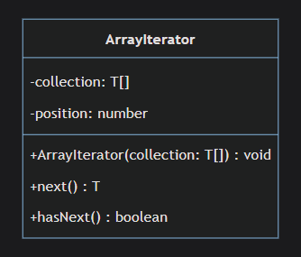
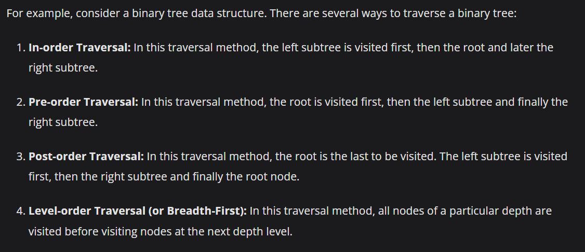
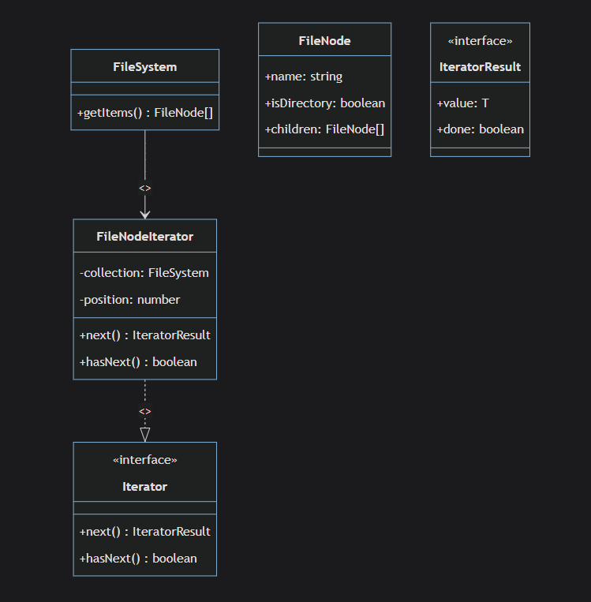
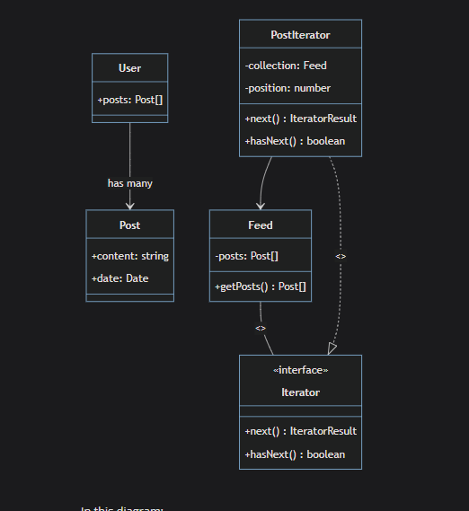

# iterator

`iterator is behavioral design pattern that gives you sequential access through elements in a collection, without exposing the underling concrete  implementation of the iterator itself`

**next()**: Returns the next element in the sequence. After every call, the internal pointer increases.

**hasNext()**: Checks if there are more elements in the sequence to iterate over.

## When To Be Used

1- _Complex Navigation Logic_
where you want to traverse complex data structure like trees or graphs or even more complex , for example navigate through file systems where each directory can contains files and other directories and you might have business like calculate the total size of all files in a directory.

2- _Multiple Traversal Algorithms_
for example binary trees might need to be traversed in-order or pre-order , iterator can be used as separated object for each way and can be used across the project

3- _Accessing Elements of a Collection without Exposing its Structure_
adhere encapsulation principle , for example you want to make the client iterate over an array of books , so you decouple the client code for the implementation , this way any changing in the implementation code won't affect the client code , like change the array data to linked list data

4- _Different Collections with Same Traversal_
one iterator can be used for multiple collections

## Notes

1- class `after.ts` is a simple implementation of iterator design pattern
2- class `Users.ts` is a complete implementation of iterator design pattern , and all the complexity used within it is out of consistency

## Advantages

1- hide the internal implementation of the iterator , for example class `Users.ts` the client doesn't need to know how the internal iterator code builded or structured , just it has to know how to create it and use it

2- concent iterating on same collection , for example class `Users.ts` can create another iterator _iterator2_ and iterate over same collection but each iterator will point to different value

3-simplifies the client code

## Disadvantages

1- **Increased Complexity**: many interfaces and classes needed to implement the iterator

2- **Modification During Implementation**: Developers must be certain that the collection has never changes during the user if the iterator , because this will lead ti unexpected results

3- **Performance Consideration**:for example `next()` and `hasNext()` can lead to performance issue on large collections , developers needs to carefully implements these methods

4- **Stateful Iterators**: this is more developer concern rather that a real issue , since each iterator will have its own pointers and needs to be carefully tracked by developer

5- **Memory Consumption**: Every iterator instance carries its own state. If there are many iterators at the same time (especially for large collections), this can lead to increased memory consumption.

## UseCases

1- **File System Traversal** : _Consider the task of traversing a file system, where you want to apply an operation (like search, delete, or modify) to each file._

while the delete node is adhere the modification problem , but this problem could be solved be collecting the items needs to be deleted for example in an array and the deletes them when iteration is complete

2- **Database Query Result Processing**: _In database operations, you often have to iterate over a set of records returned by a query. An iterator can be used to traverse these records without exposing the details of database access._

3- **Social Media Feeds**: _Social media platforms like Facebook, Instagram, Twitter, etc., show feeds to the users which are essentially collections of posts, images, videos, etc. These feeds can be iterated using an Iterator pattern to load and display items one at a time or in chunks._

