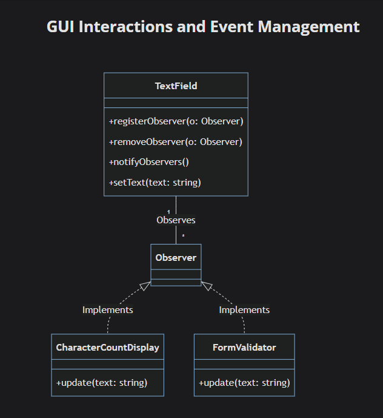
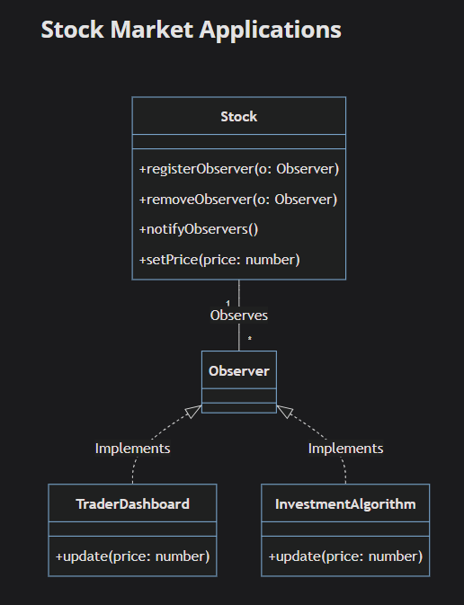
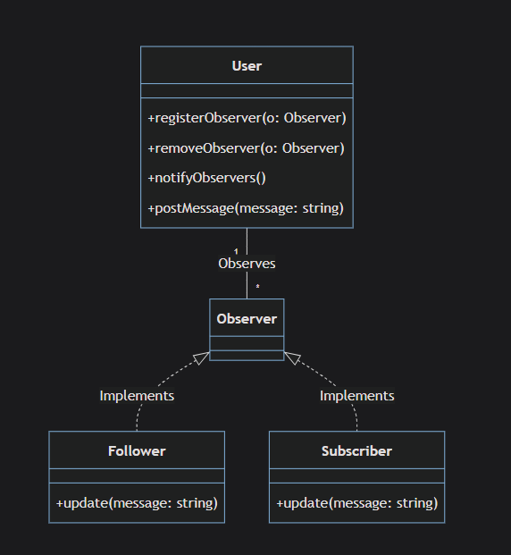

# Observer

`Observer is behavioral design pattern , it is a mechanism of subscription , it is idea that set of objects (observers) observe or listen to one object (Subject) and do certain action upon a changes happen in that object(Subject) `

## Components

_Subject_: this is the main object that will be observed by other objects

_Observer_:the listener

## User Cases

1- Ineffective Communication between objects (code example in _user case I.ts_)

objects directly communicates with each others to tell about status changes , this can lead to spaghetti code
that is difficult to maintain and read and tightly coupling components

```typeScript
//spaghetti code
class Cart {
  addItem(item: string) {
    items.push(item);
    header.updateCartCount(items.length);
    recommendations.refresh(items);
    analytics.track("cart_item_added", { item });
    // later someone adds more direct calls here...
    offersBanner.recalc(items);
    inventory.sync(items);
  }
}
```

2- Polling (code example in _after.ts_)

you have one object that changes instantly , and you need to pull this object to check its state frequently

3- Inefficient Updates

sometimes an object has tiny change or updates often , the issue is this update can target all other objects even the not related once , observer can target specific objects to updates and even make custom update

## Real World Implementation

- `WeatherData.ts` has another way for registering observers , see

```ts
class CurrentConditionsDisplay {}
```

## Advantages

1- **support for open-close**

- a new observer can be added stand alone without effecting any other observes

2- **broadcast communication**

- a Subject can notify all attached observers once a change in its internal state occurs

3- **Dynamic RelationShip**

- observer can be attached and detached dynamically during run time

4- **Decoupling Subject from Observer**

- the Subject only needs to know that object that adding to it's observer array is adhering to observers interface , it does not care about it implementation (update method for instance)

```typeScript
interface Observer {
  update(temperature: number, humidity: number, pressure: number): void;
}

class WeatherData implements Subject {
  // The WeatherData only knows about observers in terms of the Observer interface
  private observers: Observer[];
  //...
}
```

## DisAdvantages

1- **Performance Issue**

- too many state changes causes too many notifications can cause performance issues

2- **Memory Leaks**

- this is not a disadvantage of the pattern itself rather than it's a responsibility from the developer , since any unused observer needs to be detached immediately , or un wanted observes will keep accumulating in the memory

3- **Hard To Debug**

- many updated will happen from one change for example which makes it hard to debug where error is happening if it occurs

4- **No Order Guaranteed**

- if notifying observers requires an order , additional logic will needs to be added

5- **Over Notification**

- unwanted notifications might be triggered , so additional logic will needed to be added since With the simple implementation of the Observer pattern, any change to the subject results in all observers being notified, which could be inefficient.

6- **Unexpected Updates**

- Since the pattern relies on notifying all observers whenever a change happens, there can be situations where updates are triggered when _they are not needed or expected_. It's important to manage these notifications effectively to avoid unnecessary updates.

7- **TypeScript Issues**

- _Strict Type Checking_
  TypeScript's strict type checking could lead to more complex code to ensure that objects adhere to the observer and subject interfaces correctly.

  `WeatherData.ts`

  ```ts
  // New observer that only cares about humidity for plant care
  class HumidityPlantMonitor implements Observer {
    constructor(weatherData: Subject, private plantName: string) {
      weatherData.registerObserver(this);
    }

    // Problem: Must implement the full update interface
    update(temperature: number, humidity: number, pressure: number): void {
      // Only cares about humidity
      if (humidity < 30) {
        console.log(
          `💧 Your ${this.plantName} needs water! Current humidity: ${humidity}%`
        );
      } else if (humidity > 70) {
        console.log(
          `⚠️ Your ${this.plantName} might be overwatered! Current humidity: ${humidity}%`
        );
      }

      // temperature and pressure are unused but required
    }
  }
  ```

  current implementation for observer forces every observer to handle exactly three parameters (temperature, humidity, pressure), even if they only care about one or two.

  _solution I found for this case_

  `pull solution`
  pull or use the mode and use the only data needed

  ```ts
  interface Subject {
    registerObserver(o: Observer): void;
    removeObserver(o: Observer): void;
    notifyObserver(): void;
    getTemperature(): number;
    getHumidity(): number;
    getPressure(): number;
  }

  interface Observer {
    update(weatherData: Subject): void;
  }

  // Now each observer can pull only what it needs
  class TemperatureAlertDisplay implements Observer {
    constructor(private weatherData: Subject, private threshold: number) {
      weatherData.registerObserver(this);
    }

    update(weatherData: Subject): void {
      // Only pulls temperature data
      const temperature = weatherData.getTemperature();
      if (temperature > this.threshold) {
        console.log(
          `🚨 ALERT! Temperature ${temperature} exceeds threshold ${this.threshold}`
        );
      }
    }
  }
  ```

- _Compatibility Issues_
  While TypeScript brings many benefits, some JavaScript libraries or frameworks might not play well with it, and hence, implementing patterns could be a bit tricky.

## Use Cases

1- **GUIs**


_Subject_: is the `TextField`

_Observers_:`CharacterCountDisplay` where it can count the characters the use input , `FormValidator` it might check if the input of the user accessed the characters limit

2- **Stock**


_Subject_: is the `Stock`

_Observers_:`TraderDashboard` once the price changes the dashboard will be updated accordingly , `InvestmentAlgorithm`purchase the stock when it's low and sell it when its high

3- **SocialMedia**



_Subject_: is the `User`

_Observers_:`Follower` view show the number of followers and`Subscriber`view show the number of subscribers when user post something they will git massage or notification somewhere , another case when number of followers or subscriber change the view can update simultaneously

## Final Notes

1-observers can maintain their own state separate from the subject. This is useful for tracking observer-specific information, customizing behavior, or performing calculations based on updates.

`WeatherData.ts`

```typeScript
// Advanced observer with its own state
class WeatherStatisticsDisplay implements Observer {
  private temperatureSum: number = 0;
  private humiditySum: number = 0;

   constructor(weatherData: Subject, private displayName: string) {
    weatherData.registerObserver(this);
  }

    update(temperature: number, humidity: number, pressure: number): void {
    // Update our internal state
    this.temperatureSum += temperature;
    this.humiditySum += humidity;

        if (temperature > this.highestTemperature) {
      this.highestTemperature = temperature;
    }
    if (temperature < this.lowestTemperature) {
      this.lowestTemperature = temperature;
    }

    this.display();
}

  private display(): void {
    console.log(`Average temperature: ${(this.temperatureSum / this.readingCount).toFixed(1)}°C`);
      console.log(`Average humidity: ${(this.humiditySum / this.readingCount).toFixed(1)}%`);
  }

    // Methods to access the observer's own state
  getAverageTemperature(): number {
    return this.temperatureSum / this.readingCount;
  }

    getTemperatureRange(): {low: number, high: number} {
    return {
      low: this.lowestTemperature,
      high: this.highestTemperature
    };
  }
}

```
