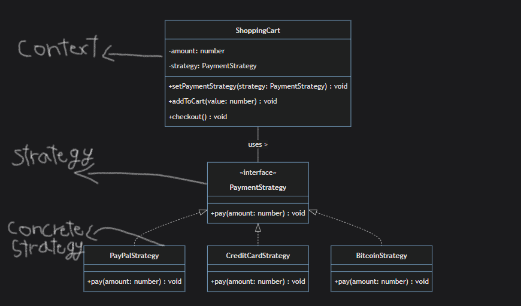
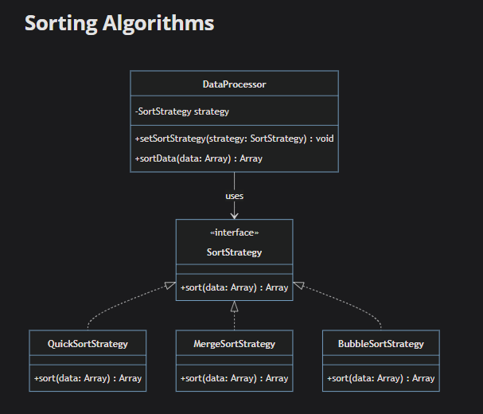

# Strategy

`strategy is behavioral design pattern , that separate algorithms into classes and give their objects a way to be used interchangeably`

## Components

1- **Strategy**: common interface to all strategies (algorithms) versions , this interface is used by the _Context_ to all other _Concrete Strategies_.

2- **Concrete Strategy**: classes the implement the _Strategy_ interface.

3- **Context**: the class that defines and maintain a reference to strategy object.

## Use Cases

`Strategy Pattern isn't something you use at the start of project , the needs of this pattern comes when the context class gets bloated with many conditions that differs the behavior of object completely base on certain values and parameters`

1- **Multiple Conditions Statements**

2- **Preparation For The Future**: in `after.ts` let's assume we started the project with _PayPal Strategy_ it's obvious that other payment methods well needed in the future as _CreditCard Strategy_.

3- **isolate complex external libraries or frameworks**: in `after.ts` the implementation of _Paypal Strategy_ might be so complex and differs much than other payment strategies , another case you might to use specific framework for certain case rather than the general used one.

4- **the need for switching algorithms at run time**: as it done in `after.ts` and we called _setPaymentStrategy()_ at client code.

## Advantages

1- **Adhere Open/Close Principle**: since we are using interface for strategy , adding a new strategy will only cause to implements this interface to the new strategy.

2- **Runtime Flexibility**: set new strategy from client code.

3- **Avoid Conditional Statements**: This pattern helps avoid conditional statements to select desired behavior.

4- **Code Organization**: Strategy pattern helps organize code related to specific behavior in separate classes. for example in `ImageFilter.ts` each filter has separated class.

## DisAdvantages

1- **Inconsistent Strategies**: this means that a strategy might be implemented to a class that is completely different from other classes , for example `ImageProcessor.ts` all classes that implements the strategy is applying filters , but it might there a class that convert the image format from jpg to png that also apply this strategy interface , and there's no way to detect this issue.

2- **Discoverability**: for larger projects it's hard for new developers to understand the flow of the application as the logic might spread over different strategies.

3- **Dependency Management**: this not a big disadvantage but Every strategy implemented might come with its own set of dependencies,and it can be challenging to manage those dependencies.

4- **Code Complexity Increases**: as there can be many interface and abstraction needed to be applied to implement the design pattern.

## Use Cases

1- **Sorting Algorithms**: Strategy might be applied for `sorting algorithm` as _QuickSortAlgorithm_ , _MergeSortAlgorithm_ , _BubbleSortAlgorithm_

2- **Payment Processing**: _CreditCardStrategy_, _PayPalStrategy_, and _BankTransferStrategy_.

3- **Compression Algorithms**: _ZipStrategy_, _RarStrategy_, and _TarStrategy_.

4- **Image Rendering**: _SVGStrategy_, _BitmapStrategy_, and _WebGLStrategy_.
