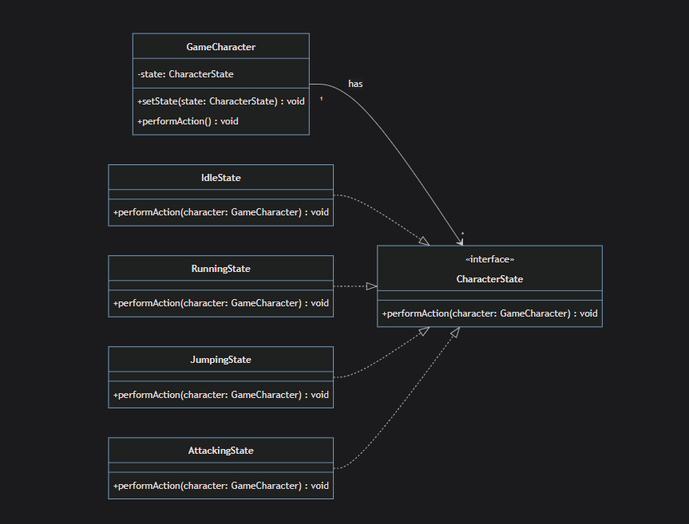
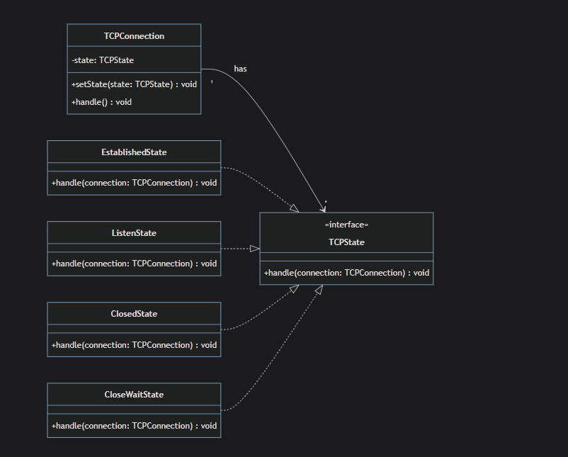
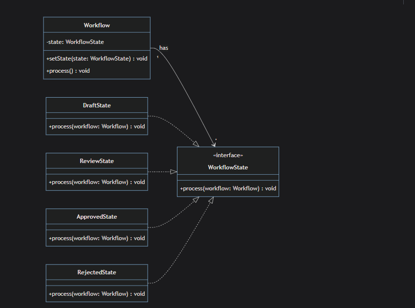
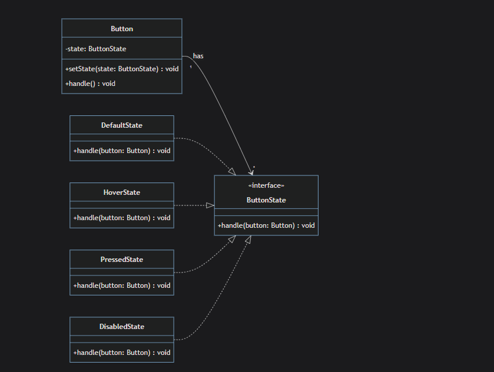

# State

`State is behavioral Design pattern that allows you to change the behavior of object by changing it's internal state.`
`The pattern extracts state-related behaviors into separate state classes and forces the original object to delegate the work to an instance of these classes, instead of acting on its own.`

## Components

1- **State**: internal state of the _Context_

2- **State Class**: encapsulate the behavior of Object.
_info from quiz_ :it has the methods that the concrete states must implement to perform their behavior.

3- **Context**: _info from quiz:_ responsible for changing the state of itself since _Context_ delegates state-specific behavior to the appropriate State object.

## When To Use

1- **High coupling between states and behaviors**:
in my opinion this is the best indicator to use this design pattern, for example `mediaPlayer-before.ts` each method changes the state of the object , this considered high coupling

2- **Large conditional or switch-case statements based on object state**:this point adhere to use the design pattern it's very important to note that this design pattern is based on the _internal state_ of the object , so changes must be effecting the properties of the object directly

3- **Complex or error-pone state transactions**:_State transactions_ = Moving from one state to another (like OFF → ON → DIMMED → FLASHING)
_Complex/Error-prone_ = When these transitions have many rules and it's easy to make mistakes.

```typeScript
//Without State Pattern (Error-prone):

class TrafficLight {
  private currentState = "RED";
  private timer = 0;

  changeState() {
    // ❌ Complex logic with many opportunities for errors
    if (this.currentState === "RED" && this.timer > 30) {
      this.currentState = "GREEN";
      this.timer = 0;
    } else if (this.currentState === "GREEN" && this.timer > 25) {
      this.currentState = "YELLOW";
      this.timer = 0;
    } else if (this.currentState === "YELLOW" && this.timer > 5) {
      this.currentState = "RED";
      this.timer = 0;
    }

    // ❌ BUGS can easily happen:
    // - What if timer is negative?
    // - What if someone sets currentState to "BLUE"?
    // - What if we go from RED directly to YELLOW by mistake?
    // - What about emergency mode? Night mode? Maintenance mode?
  }
}

//With State Pattern (Clean & Safe):
interface TrafficLightState {
  nextState(context: TrafficLight): void;
  canTransitionTo(newState: string): boolean;
}

class RedState implements TrafficLightState {
  nextState(context: TrafficLight): void {
    console.log("RED → GREEN");
    context.setState(new GreenState());
  }

  canTransitionTo(newState: string): boolean {
    return newState === "GREEN"; // ✅ Only valid transition
  }
}

class GreenState implements TrafficLightState {
  nextState(context: TrafficLight): void {
    console.log("GREEN → YELLOW");
    context.setState(new YellowState());
  }

  canTransitionTo(newState: string): boolean {
    return newState === "YELLOW"; // ✅ Only valid transition
  }
}

class YellowState implements TrafficLightState {
  nextState(context: TrafficLight): void {
    console.log("YELLOW → RED");
    context.setState(new RedState());
  }

  canTransitionTo(newState: string): boolean {
    return newState === "RED"; // ✅ Only valid transition
  }
}

class TrafficLight {
  private state: TrafficLightState;

  constructor() {
    this.state = new RedState(); // Start with RED
  }

  setState(newState: TrafficLightState) {
    this.state = newState;
  }

  changeLight() {
    this.state.nextState(this); // ✅ Each state knows its valid next state
  }
}

```

4- **State-specific behavior is spread out throughout your code**:When you have behavior that depends on state scattered across different parts of your code instead of being organized in one place. This makes your code messy and hard to maintain. see`mediaPlayer.ts`

5- **Code is hard to extend with new states**: it means long complex conditional statements

## Advantages

1- **Single Responsibility Principle**: for example in `DocumentEditing.ts` the _EraseTool_ class is only responsible for erasing actions and _SelectionTool_ only responsible for selecting , etc...

2- **Open/closed Principles**: New State classes can be added without editing the existing code.

3-**Simplifies Complex State Logic**: by Encapsulates State-Specific Behavior in individual state classes.

4-**Dynamic State Transitions**: for example in `DocumentEditing.ts` you can changes the behavior by just creating instances of the state classes at run time.

## DisAdvantages

1- **Increased Complexity**: overkill for simple state transitions since the design pattern introduces additional classes and a level of indirection

2-**Maintaining State Consistency**: consistency means each state class do what it expected to do , and this is not a real disadvantage but more than developer responsibility to persist the consistency among state classes , on the other hand this design pattern makes the debugging more easy since each action encapsulated separately in each class

3- **Can invite higher run time cost**: in its real world implementation, class states can reach to 40 polymorphic class with -different and not simple implementation- of many tools which does invite higher runtime costs for such one monolithic class but in comparison to traditional state solutions
this over head unlikely to be significant also the design pattern gives more advantages for complexer projects

4- **State Classes Can Become Tightly Coupled**: for example in `after.ts` _OnState_ is tightly coupled to _OffState_ (it knows about it and creates it)
_OffState_ is tightly coupled to _OnState_ and so on ...

## UseCases

1- **Video Game Development**

the behavior of the character changes depending on its state.

2- **Networking SoftWare**:


3- **Workflow Engines**:

For example, a document in a document approval workflow might have states like Draft, Review, Approved, Rejected. The actions that can be performed on the document and the document's behavior will vary depending on its current state.

4- **UI Development**

In user interface (UI) development, the State pattern can be used to manage the states of UI components. For example, a button might have states like Idle, Hovered, Clicked, Disabled.
