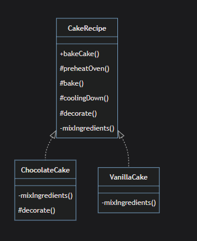
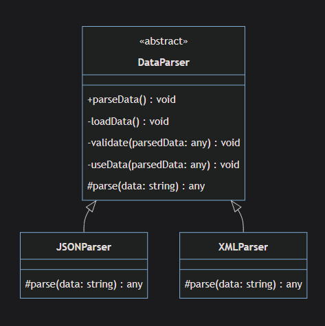
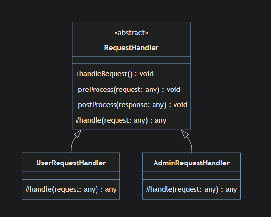
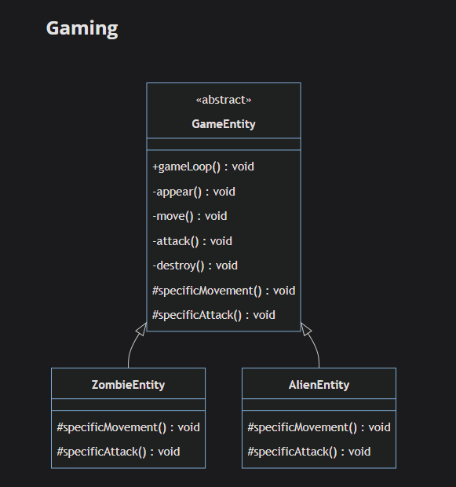

# Template

`Template is behavioral design pattern that defines skelton of algorithm and allows subclasses to inherent and override specific steps of the algorithm without changing its structure, This pattern allows you to make parts of an algorithm optional, mandatory, or customizable by the subclasses.`

## projects

`after.ts`
**cake recipe**


`DataParser.ts`


- The + sign before a method indicates that the method is public.
- The # sign before a method indicates that the method is protected.
- The - sign before a method indicates that the method is private or abstract.

## When To Use

`the main concept behind the template design pattern is when have master algorithm that used in multiple subclasses with slight modification in one of the classes this where it comes the template design pattern `

another terms from the quiz

`when you want to delegate parts of the algorithm to subclasses and when you want to share code between subclasses`

1- **Duplicate code in subclasses**: when you have identical algorithm used in many classes with slight different change in some of them or all of them.

2- **Complex Conditional Logic**: from `after.ts`

```TypeScript
abstract class CakeRecipe {
 public bakeCake(): void {
    //here it can be complex conditional statement , lead to use different versions of the algorithm
    this.typeOfCake(cake:string);
  }
 protected typeOfCake(cake:string){
    if (cake === "vanilla"){
    // some version of implementation of the algorithm
    this.preheatOven();
    this.mixIngredients();
    this.bake();
    this.coolingDown();
    //no decorate()
    }
    else if (cake === "chocolate"){
    // some other version of implementation of the algorithm
    this.preheatOven();
    this.mixIngredients();
    this.bake();
    this.coolingDown();
    this.decorate();
    }
 }

```

3- **Need to extend part of an algorithm not all of it or it has mandatory or optional parts**: in `after.ts` _mixIngredients()_ has to be mandatory , while others are optional as we as _decorate()_ has been overridden in chocolate class (extended)

4- **Algorithm has a specific sequence of operations**:If an algorithm must execute in a certain order (for example, validating input, processing, and then outputting results), this can be enforced with a Template Method.

## Advantages

1- **Avoid Code Duplication**: in `DataParse.ts` for example , main methods in super class _DataParse_ like _loadData()_ , _validate()_, _useData()_ only used in the mean super class while only _parse()_ needs to be overridden

2-**Interface Seggregation And Dependency Inversion**:The client code needs to know only about the abstract class and doesn't need to be aware of the concrete classes. The client code remains the same irrespective of the number of subclasses.
`DataParser.ts`

```typeScript

// You can add new parsers without changing existing client code!
class PDFParser extends DataParse {
  protected parse(): void {
    console.log("Parsing PDF data...");
  }
}

// ISP: Client only depends on what it needs (parseData method)
// DIP: Client depends on abstraction (DataParse), not concrete classes
function parseData(parser: DataParse /* Depends on abstraction, not concrete implementations */) {
  parser.parseData();
}

// Client code works with any parser implementation
parseData(new XMLParser());
parseData(new JSONParser());
parseData(new PDFParser()); // New parser works without changing client code

```

3- **Encapsulation of Complexities**: in `DataParser.ts`

```typeScript
parseData(new xmlParser());

```

client does not need to know how the _xmlParser_ class is implemented

4- **Control over the Subclasses**: which you can determine which methods to be overridden and which is not

5- **Extensibility** : add new parser for example _CSVParser_ easily

## DisAdvantages

1- **Inheritance Complexity**: for example in `DataParser.ts` the tight coupling between subclass like _XMLParser_ & superclass _DataParser_ needs you to be careful about what methods can inherits and how many because when ever those methods changed in the super class all subclasses will have to be checked

2- **Limited Flexibility in the Algorithm Structure**: template design pattern is fixed in term of running algorithms , and this is can be considered more as use case rather than disadvantages

3- **Risk of Breaking the Algorithm**: for example in `DataParser.ts` overriding _ParseData()_ method will fatality break the algorithm or if the developer could not handle the returned data probably when override _parse()_ this will fail the next methods the depends on it

4- **Lack of Runtime Flexibility**:

as we saw here in `DataParser.ts`

```typeScript
parseData(new XMLParser());
```

now way you can change the parser at the run time in compare of Strategy Design Pattern where we could for example in `ImageFilter.ts` to change the filter at the run time using _setFilterStrategy()_

5- **Overuse can lead to many small classes**:When used excessively, the pattern can lead to a large number of classes, each of which overrides a small part of an algorithm. This could make the code harder to understand and maintain.

## advice from the instructor

`Despite these caveats, the Template Method pattern can still be a powerful tool in your design pattern arsenal. As with all patterns, the key is understanding when it is appropriate to use and balancing its benefits with its potential downsides.`

[Manik (Cloudaffle)](https://cloudaffle.com/series/behavioral-design-patterns/template-method-criticism/)

## Use Cases

`all use cases is about one master class performing certain tasks and subclasses that specialize certain takes`

1- **Request Handler**


_handleRequest()_ should be implemented like this

```typeScript
public handleRequest(){
this.pre-process()
this.handle()
this.post-process()
}
```

while two type of handlers _userRequestHandler_ and _adminRequestHandler_ override _handle_

2- _Gaming_



_gameLoop_ will handle in some way all other methods implementation and the characters will override the methods shown in diagram
