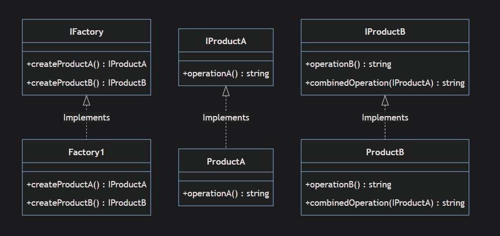
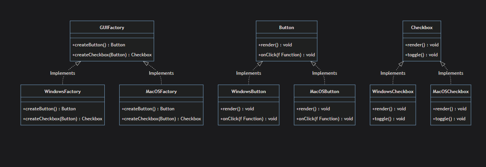
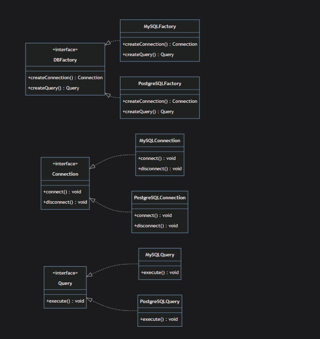
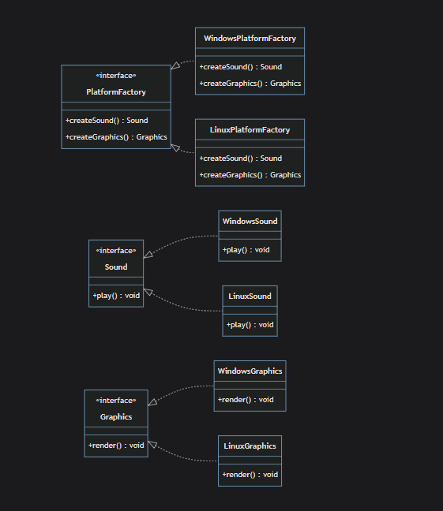

# Abstract Factory

`Creational Design Pattern the provides an interface to create families of related or dependant objects without specifying their concrete classes.`

## Projects

`after.ts`  


## When To Use

`The Abstract Factory pattern It is typically used when a system needs to be independent from the way the objects it creates are generated or it needs to work with multiple types of objects.`

for Example

- without Abstract Factory (Tightly Coupled):

```typeScript

// Your code KNOWS exactly how to create objects
class OrderService {
  processOrder() {
    // You're directly creating specific objects
    const button = new WindowsButton();      // Hardcoded!
    const textbox = new WindowsTextBox();    // Hardcoded!
    const dialog = new WindowsDialog();      // Hardcoded!

    button.render();
    textbox.render();
    dialog.render();
  }
}
```

Problem: If you want to switch to Mac style, you must change the code:

```typeScript
const button = new MacButton();      // Change here
const textbox = new MacTextBox();    // Change here
const dialog = new MacDialog();      // Change here

```

- With Abstract Factory (Independent):

```typeScript
// Your code doesn't care HOW objects are created
class OrderService {
  processOrder(factory: UIFactory) {  // Just needs a factory
    // Doesn't know if it's Windows, Mac, or Linux!
    const button = factory.createButton();
    const textbox = factory.createTextBox();
    const dialog = factory.createDialog();

    button.render();
    textbox.render();
    dialog.render();
  }
}

// Usage - you can switch entire families easily
const windowsFactory = new WindowsUIFactory();
orderService.processOrder(windowsFactory);  // Windows style

const macFactory = new MacUIFactory();
orderService.processOrder(macFactory);      // Mac style - same code!

```

- Work with multiple types of objects

```typeScript

// Windows family - all components match Windows style
interface WindowsUIFactory {
  createButton(): WindowsButton;
  createTextBox(): WindowsTextBox;
  createDialog(): WindowsDialog;
}

// Mac family - all components match Mac style
interface MacUIFactory {
  createButton(): MacButton;
  createTextBox(): MacTextBox;
  createDialog(): MacDialog;
}

```

1- **Interrelated Dependencies**: it means that you have objects that needs to work together in order to action.

for example

```typeScript
// ❌ WITHOUT Abstract Factory - You can accidentally mix incompatible objects!

class OrderService {
  processOrder() {
    // Oops! Mixing MySQL connection with PostgreSQL query builder!
    const connection = new MySQLConnection();        // MySQL
    const queryBuilder = new PostgreSQLQueryBuilder(); // PostgreSQL - WRONG!
    const transaction = new MySQLTransaction();     // MySQL

    // This will FAIL because they're incompatible!
    const query = queryBuilder.buildQuery();
    connection.execute(query);  // ❌ Error: PostgreSQL query on MySQL connection!
  }
}

```

The pattern allows you to enforce this constraint automatically.

```typeScript
// Define what a database family must provide
interface DatabaseFactory {
  createConnection(): DatabaseConnection;
  createQueryBuilder(): QueryBuilder;
  createTransaction(): Transaction;
}

// MySQL family - all components work together
class MySQLFactory implements DatabaseFactory {
  createConnection(): DatabaseConnection {
    return new MySQLConnection();
  }

  createQueryBuilder(): QueryBuilder {
    return new MySQLQueryBuilder();  // Matches MySQL!
  }

  createTransaction(): Transaction {
    return new MySQLTransaction();   // Matches MySQL!
  }
}

// PostgreSQL family - all components work together
class PostgreSQLFactory implements DatabaseFactory {
  createConnection(): DatabaseConnection {
    return new PostgreSQLConnection();
  }

  createQueryBuilder(): QueryBuilder {
    return new PostgreSQLQueryBuilder();  // Matches PostgreSQL!
  }

  createTransaction(): Transaction {
    return new PostgreSQLTransaction();    // Matches PostgreSQL!
  }
}

// Your code - can't mix incompatible objects anymore!
class OrderService {
  processOrder(factory: DatabaseFactory) {
    // ✅ All objects come from the SAME factory - guaranteed to match!
    const connection = factory.createConnection();
    const queryBuilder = factory.createQueryBuilder();
    const transaction = factory.createTransaction();

    // These will ALWAYS work together because they're from the same family
    const query = queryBuilder.buildQuery();
    connection.execute(query);
    transaction.commit();
  }
}

// Usage - you MUST use a complete family
const mysqlFactory = new MySQLFactory();
orderService.processOrder(mysqlFactory);
// ✅ Gets: MySQLConnection + MySQLQueryBuilder + MySQLTransaction (all match!)

const postgresFactory = new PostgreSQLFactory();
orderService.processOrder(postgresFactory);
// ✅ Gets: PostgreSQLConnection + PostgreSQLQueryBuilder + PostgreSQLTransaction (all match!)

```

2- **Switching Product Families**:If you need to provide a way to swap out entire "families" of objects, an Abstract Factory can make this easier as we say in above examples.

```typeScript
// Usage - you can switch entire families easily
const windowsFactory = new WindowsUIFactory();
orderService.processOrder(windowsFactory);  // Windows style

const macFactory = new MacUIFactory();
orderService.processOrder(macFactory);
```

3- **Encapsulating Complex Creation Logic**: If creating an object involves a complex process that has dependencies on other objects or on some configuration.

```typeScript
class ProductB implements IProductB {
  operationB(): string {
    return "create Operation B";
  }

  combinedOperation(collaborate: IProductA): string {
    return `${collaborate.operationA()} collaborated with operation B`;
  }
}

class Factory implements IFactory {
  createOperationA(): IProductA {
    return new ProductA();
  }

  createOperationB(): IProductB {
    return new ProductB();
  }
}
```

4- **Isolating Concrete Classes**: If you want to isolate the concrete classes used in your application from the code that constructs the objects.

```typeScript
// ❌ WITHOUT Isolation - OrderService KNOWS about concrete classes
class OrderService {
  processOrder() {
    // OrderService directly uses concrete classes - NOT isolated!
    const connection = new MySQLConnection();        // Knows about MySQLConnection
    const queryBuilder = new MySQLQueryBuilder();    // Knows about MySQLQueryBuilder
    const transaction = new MySQLTransaction();      // Knows about MySQLTransaction

    const query = queryBuilder.buildQuery();
    connection.execute(query);
    transaction.commit();
  }
}
```

```typeScript
//creating objects is isolated from the code that constructs them
class OrderService {
  processOrder(factory: DatabaseFactory) {
    const connection = factory.createConnection();
    const queryBuilder = factory.createQueryBuilder();
    const transaction = factory.createTransaction();

    const query = queryBuilder.buildQuery();
    connection.execute(query);
    transaction.commit();
  }
}
```

5- **Consistent Object Creation**: If your code has dependencies on specific types of objects that need to be created together and you want to enforce consistency, Abstract Factory is a good choice as we saw in the "_data base_" example.

6- **Supporting Multiple Architectures**: If your software needs to run in different environments that require different implementations of a set of related objects data as we saw in the "_data base_" example.

## Comparison between Factory & Abstract Factory

### Factory Design Pattern

- Factory method deals with the problem of creating objects without specifying the exact class of object that will be created.

- It provides a simple decision making class that returns one of several possible subclasses of an abstract base class depending on the data that are provided.

- It's about creating products which are related by a common theme.
  remember the '_car_' class?

- it relies on inheritance as it is typically implemented in a subclass selecting which class to instantiate.

- Use the Factory Method pattern when you don't know beforehand the exact types and dependencies of the classes your code should work with.

### Abstract Factory

- Abstract Factory is a super-set of Factory method pattern. It's like a factory of factories.

- It provides an interface for creating families of related or dependent objects without specifying their concrete classes.

-It returns the factory of classes. Thus, the Abstract Factory is the interface to create factory classes.

```typeScript
interface IFactory {// ← THIS shows IFactory creates factory classes
  createOperationA(): IProductA;
  createOperationB(): IProductB;
}

// This is a CONCRETE FACTORY (implements the interface)
class Factory implements IFactory {
  createOperationA(): IProductA {
    return new ProductA();  // Creates ProductA
  }

  createOperationB(): IProductB {
    return new ProductB();  // Creates ProductB
  }
}
```

- It encapsulates a group of individual factories with a common goal.

- Abstract Factory relies on object composition, as object creation is implemented in methods exposed in the factory interface.

Inheritance (is-a):

```typeScript
class Dog extends Animal {  // Dog IS-A Animal
  // ...
}

```

Object Composition (has-a):

```typeScript
class Car {
  private engine: Engine;  // Car HAS-A Engine (composition)
  // ...
}
```

looking at `after.ts`

```typeScript
//methods exposed in the factory interface.
interface IFactory {
  createOperationA(): IProductA;
  createOperationB(): IProductB;
}

function client(factory: IFactory): string {
  const operationA = factory.createOperationA();  // ← Composes ProductA
  return factory.createOperationB().combinedOperation(operationA);  // ← Composes ProductB
}
```

also

```typeScript

class Factory implements IFactory {
  createOperationA(): IProductA {
    return new ProductA();  // ← Creates and returns (composition)
  }

  createOperationB(): IProductB {
    return new ProductB();  // ← Creates and returns (composition)
  }
}

```

- Use the Abstract Factory pattern when your code needs to work with various families of related products, but you don’t want it to depend on the concrete classes of those products—they might be unknown beforehand or you simply want to allow for future extensibility.

## GUI.ts

Suppose you're designing a framework that should work across multiple platforms (e.g., Windows and MacOS), and each platform has a different set of UI elements (like buttons, checkboxes, etc.). Each platform's UI elements behave differently and have different appearances, but the actual functionality of these elements (clicking a button, checking a checkbox, etc.) is essentially the same.  


## Advantages

1- **Consistency among products**:Abstract factory ensures that the products being created are all compatible with each other and belong to the same family for example in `GUI.ts` all the GUI families belongs to IGUIFactory families.

2- **Avoiding concrete product classes**:This pattern allows a program to use the interfaces of products instead of the concrete classes.

```typeScript
function renderUI(factory: GUIFactory) {
  const button = factory.createButton();
  const checkbox = factory.createCheckbox(button);

  button.render();
  checkbox.render();

  button.onClick(() => console.log("Button clicked!"));
  checkbox.toggle();
}
```

we used "_GUIFactory_" (the interface of the factory) instead of using windowsFactory for example.

3- **Code reusability and swapping product families**:The Abstract Factory pattern allows for easy swapping of product families, enhancing code reusability.

```typeScript
console.log("App: Launched with the Windows factory.");
renderUI(new WindowsFactory());

console.log("App: Launched with the MacOS factory.");
renderUI(new MacOSFactory());

```

4- **Single Responsibility Principle**: Each concrete factory is only responsible for creating products of a single variant and hence it complies with the Single Responsibility Principle.

```typeScript
class WindowsFactory implements GUIFactory {
  createButton(): Button {
    return new WindowsButton();
  }
  createCheckbox(button: Button): Checkbox {
    return new WindowsCheckbox(button);
  }
}
```

What "Single Variant" Means?
WindowsFactory = Single variant (Windows products only)
MacOSFactory = Single variant (MacOS products only)

What Would Be "Multiple Variants"?

```typeScript

// ❌ BAD: Factory creating products from MULTIPLE variants
class MixedFactory implements GUIFactory {
  createButton(): Button {
    // Sometimes Windows, sometimes MacOS - MULTIPLE variants!
    if (Math.random() > 0.5) {
      return new WindowsButton();  // Windows variant
    } else {
      return new MacOSButton();    // MacOS variant
    }
  }

  createCheckbox(button: Button): Checkbox {
    // Also mixing variants - BAD!
    return new WindowsCheckbox(button);
  }
}

```

5-**Open/Closed Principle**:
It's easy to introduce new factories and product families without changing the existing client code.

```typeScript
class LinuxFactory implements GUIFactory {
  createButton(): Button {
    return new LinuxButton();
  }
  createCheckbox(button: Button): Checkbox {
    return new LinuxCheckbox(button);
  }
}
```

## Disadvantages

1- **Complexity**:The complexity criticism of the Abstract Factory pattern arises from the fact that it:
1- requires creating a new concrete factory for every new "family" of products.
2- create corresponding interface for each product in that family. This can add a significant amount of extra classes and interfaces to your codebase, which might not be necessary for simpler applications.

```typeScript

// The abstract factory interface
interface GUIFactory {
  createButton(): Button;

  createMenu(): Menu;
}

// Concrete implementations
class MobileFactory implements GUIFactory {
  createButton(): Button {
    return new MobileButton();
  }

  createMenu(): Menu {
    return new MobileMenu();
  }
}

//====================================================

//interface for each corresponding

interface Button {
  click(): void;
}

interface Menu {
  open(): void;
}

```

2- **Limited Flexibility In Modifying Product Families**:
The pattern can be restrictive in terms of flexibility. When new types of products need to be introduced, the core factory interface has to change, affecting all the factory implementations.  
 This violates the Open/Closed Principle of SOLID design principles which states that "software entities ... should be open for extension, but closed for modification".

```typeScript
interface GUIFactory {
 createButton(): Button;

 createMenu(): Menu;

//new product added
 createControlStick(): ControlStick;
}
```

By changing the GUIFactory interface, we've violated this principle since When you add createControlStick() to the interface, you must modify all existing concrete factories.

For each new product, we need to:

1- Add a new method in the GUIFactory interface.
2- Implement the new method in all existing concrete factory classes.
3- Create new product interfaces and concrete classes for the new product.

3- **Code Maintenance**: Code Maintenance can indeed become more complex with the Abstract Factory Pattern due to the increased number of classes and interfaces.

4- **Tight Coupling With Client Code**: if you change the interface, you might need to change the client code as well. This may not be a major concern, but it's a dependency that you need to manage.  
as we say in the previous example adding new product would require to:

```typeScript

function renderUI(factory: GUIFactory) {
  const button = factory.createButton();
  button.click();

  const menu = factory.createMenu();
  menu.open();

  const controlStick = factory.createControlStick(); // Handle the new object
  controlStick.move();
}

```

So, even though the Abstract Factory pattern can help to separate the details of object creation from the client code, it can also introduce a level of dependency between the client code and the factory interfaces

## Use Cases

1- **GUI Libraries**: as we saw in GUI.ts

2-**DataBases**:  


3- **Cross Platforms Developments**:  

