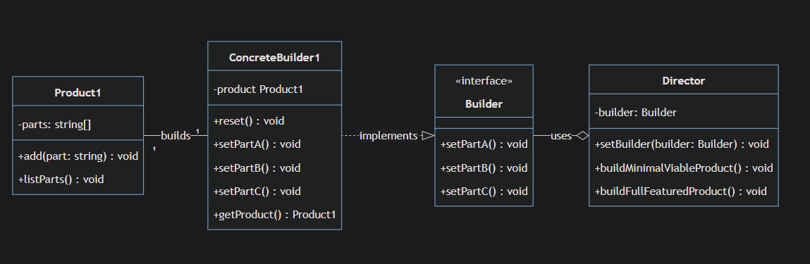
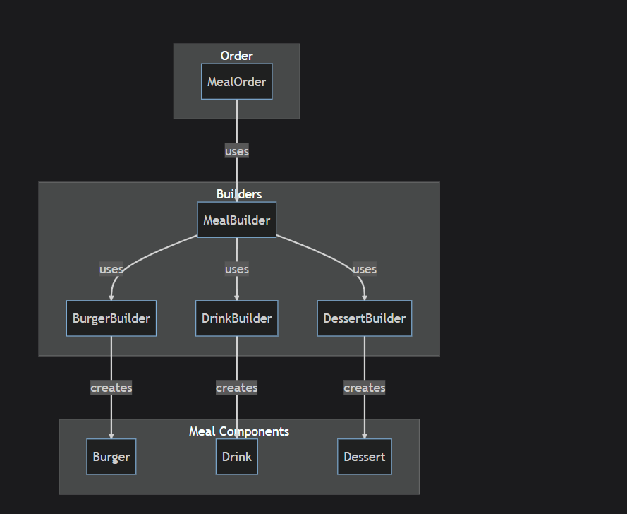
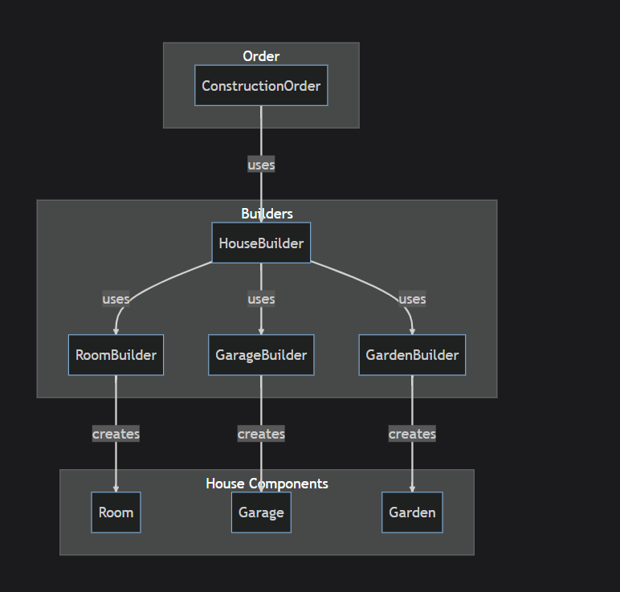
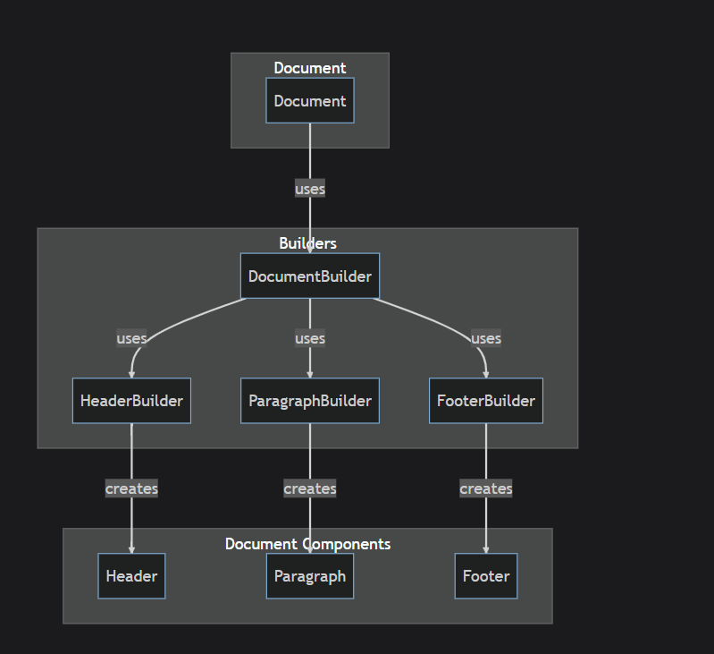
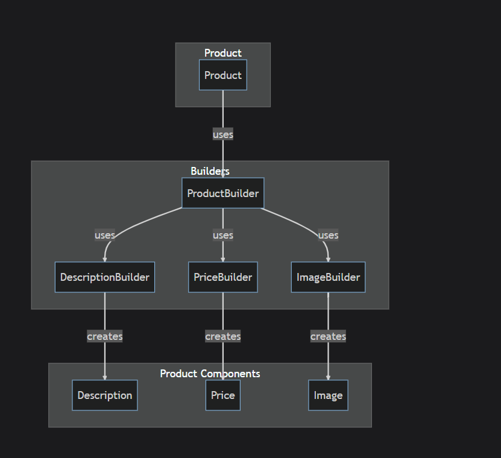

# Builder

`The Builder Creational Design Pattern that lets you build complex objects.`

## Implementation



1- **Director**: it's just responsible for ordering the steps of building the object , the actual building is not happening here , in the implementation diagram we have `buildMinimalViableProduct()` that only uses on building method , `buildFullFeaturedProduct()` uses all of them , usually when the object builds `reset()` called to prepare for the next build.

2- **Concrete Builder**: it has the methods the builds the actual object `setPartA()`,`setPartB()`, `setPartC()`.

3- **Product1**: Is the product class, where each product consists of multiple parts.
The add() method adds a part to the product.

## When To Use The Builder Pattern

1- **Complex Object Creation**: If your software needs to create complex objects that have many attributes, some of which are optional and some are mandatory, the Builder pattern can simplify this process and make your code more readable.

2- **Step-by-step Object Creation**: an object must be created in multiple steps, especially if these steps need to be executed in a specific order, the Builder pattern can be a good fit.

3- **Combination Explosion**: If you are dealing with an object that can be configured in many different ways (such that attempting to provide a constructor for every combination of configurations would be impractical), the Builder pattern can be useful.

4- **Constructing Composite Structures**: If you need to construct a composite or hierarchical structure (like a tree), a builder can make it easier to understand and maintain the code.

5- **Immutable Objects**: "_Immutable_" means "cannot be changed after creation", If you want to construct an immutable `UserProfile(id , name , email , age , address , phone)` object with many attributes, the Builder pattern can be used to construct the object in steps, and then deliver the final, immutable object.

6- **Code Clarity**: If you have a constructor with many parameters and it's not clear what each parameter is for (because they have the same type or aren't self-explanatory), using the Builder pattern can improve code readability.

```TypeScript
class DatabaseConnection {
  constructor(
    host: string,
    port: number,
    database: string,
    username: string,
    password: string,
    timeout: number,
    retries: number,
    ssl: boolean
  ) {
    // ... setup code
  }
}

// ❌ CONFUSING: What do these parameters mean?
const db = new DatabaseConnection(
  "localhost",  // What is this?
  5432,         // What is this?
  "myapp",      // What is this?
  "admin",      // What is this?
  "secret123",  // What is this?
  30000,        // What is this?
  3,            // What is this?
  true          // What is this?
);

class DatabaseConnectionBuilder {
  setHost(host: string): this { /* ... */ return this; }
  setPort(port: number): this { /* ... */ return this; }
  setDatabase(database: string): this { /* ... */ return this; }

  //rest of code

   build(): DatabaseConnection { /* ... */ }

const db = new DatabaseConnectionBuilder()
  .setHost("localhost")        // ✅ Obviously the host
  .setPort(5432)              // ✅ Obviously the port
  .setDatabase("myapp")
  //rest of properties
  .build()
}
```

## Advantages

1- **Fluent Interface**: constructing complex objects step by step.
In TypeScript (and many other languages), builders can be used to create a fluent interface. This makes the client code more readable and easy to write.

2- **Separation of Construction Logic and Business Logic**:"_Construction Logic_": How to build the object (the steps).  
'_Business Logic_': what the object actually does (its purpose)  
for example in `Customer.ts` the object builded within "_CustomerBuilder_" but represented within customer class '_Customer_'.

3- **Different Representations**: The representation can be different according to the representation of the object inside the builder or the object builder itself , but either ways it's up to the builder itself ,departed from the Business logic layer.

"_Example: Different Customer Representations_"

```TypeScript
class CustomerBuilder {
  private firstName: string = "";
  private lastName: string = "";
  private email: string = "";
  private phoneNumber: string = "";

  setFirstName(name: string): this {
    this.firstName = name;
    return this;
  }

  setLastName(name: string): this {
    this.lastName = name;
    return this;
  }

  setEmail(email: string): this {
    this.email = email;
    return this;
  }

  setPhoneNumber(phone: string): this {
    this.phoneNumber = phone;
    return this;
  }

  // ✅ DIFFERENT REPRESENTATIONS using the same builder:

  // Basic customer - only required fields
  buildBasicCustomer(): Customer {
    return new Customer(
      this.firstName || "Unknown",
      this.lastName || "Customer",
      this.email || "no-email@example.com",
      "N/A"
    );
  }

  // Premium customer - all fields required
  buildPremiumCustomer(): Customer {
    if (!this.firstName || !this.lastName || !this.email || !this.phoneNumber) {
      throw new Error("Premium customers require all fields");
    }
    return new Customer(this.firstName, this.lastName, this.email, this.phoneNumber);
  }
}
```

"_Different ConcreteBuilder Classes for Customer_"

```TypeScript
class BasicCustomerBuilder {
  private firstName: string = "";
  private lastName: string = "";
  private email: string = "";

  setFirstName(name: string): this {
    this.firstName = name;
    return this;
  }

  setLastName(name: string): this {
    this.lastName = name;
    return this;
  }

  setEmail(email: string): this {
    this.email = email;
    return this;
  }

  build(): Customer {
    return new Customer(
      this.firstName || "Unknown",
      this.lastName || "Customer",
      this.email || "no-email@example.com",
      "N/A" // No phone for basic customers
    );
  }
}

// 2. Premium Customer Builder - all fields required
class PremiumCustomerBuilder {
  private firstName: string = "";
  private lastName: string = "";
  private email: string = "";
  private phoneNumber: string = "";

  setFirstName(name: string): this {
    this.firstName = name;
    return this;
  }

  setLastName(name: string): this {
    this.lastName = name;
    return this;
  }

  setEmail(email: string): this {
    this.email = email;
    return this;
  }

  setPhoneNumber(phone: string): this {
    this.phoneNumber = phone;
    return this;
  }

  build(): Customer {
    if (!this.firstName || !this.lastName || !this.email || !this.phoneNumber) {
      throw new Error("Premium customers require all fields");
    }
    return new Customer(this.firstName, this.lastName, this.email, this.phoneNumber);
  }
}

// ✅ Using PremiumCustomerBuilder
const premiumBuilder = new PremiumCustomerBuilder();
const premiumCustomer = premiumBuilder
  .setFirstName("Alice")
  .setLastName("Smith")
  .setEmail("alice@example.com")
  .setPhoneNumber("123-456-7890")
  .build();
```

3- **Increased Object Integrity**:The Builder pattern helps in constructing an object step-by-step, verifying each step before proceeding to the next one. This process can ensure the object constructed is always valid, which leads to higher data integrity.

4- **Immutability**: Once the object has been constructed, it's often returned as an immutable object. Immutability has many advantages including, simplicity (since immutable objects can be easily shared or cached), safety ( since they can't be changed once created), and it aids in writing cleaner code.

5- **Reduced Parameter Complexity**:When you have objects with many parameters, constructors become messy and confusing:

```TypeScript
// ❌ COMPLEX: Too many parameters
class Customer {
  constructor(
    firstName: string,
    lastName: string,
    email: string,
    phoneNumber: string,
    address: string,
    city: string,
    zipCode: string,
    country: string,
    age: number,
    membershipType: string
  ) {
    // ... constructor code
  }
}

// ❌ CONFUSING: What's the 6th parameter again?
const customer = new Customer(
  "John",           // firstName
  "Doe",            // lastName
  "john@email.com", // email
  "123-456-7890",   // phoneNumber
  "123 Main St",    // address
  "NYC",            // city ← Hard to remember order!
  "10001",          // zipCode
  "USA",            // country
  30,               // age
  "Premium"         // membershipType
);
```

```TypeScript
✅ Solution: Builder Reduces Parameter Complexity
class CustomerBuilder {
  private firstName: string = "";
  private lastName: string = "";
  private email: string = "";
  private phoneNumber: string = "";
  private address: string = "";

    // ✅ One parameter at a time - no confusion!
  setFirstName(firstName: string): this {
    this.firstName = firstName;
    return this;
  }

  setLastName(lastName: string): this {
    this.lastName = lastName;
    return this;
  }

  setEmail(email: string): this {
    this.email = email;
    return this;
  }

  //etc

}

```

6- **Easier to Extend**:If you want to add a new feature to the product, you don't need to modify the Director or the client code, but you can extend the Builder class to add this new feature. This makes the system easier to extend and maintain.

## Disadvantages

1- **Increased Complexity**: The Builder pattern introduces an additional layer of abstraction and more classes to the project. This could increase the complexity of the code and make it harder to understand and maintain for those not familiar with the Builder pattern.  
for example in `Customer.ts` this implementation has an interface and two classes (CustomerBuilder and CustomerDirector) to handle the creation of Customer.

2- **Additional Code**: Implementation of the Builder pattern can result in significant additional code, especially for small classes with few fields. This may unnecessarily increase the size of the codebase.

3- **Runtime Errors**: The lack of built-in compile-time checks can lead to runtime errors. For example, if you forget to set a required field in the builder, TypeScript won't notify you of this at compile-time.

In the provided example `Customer.ts`, nothing is preventing you from calling build() on CustomerBuilder without first setting all the required fields. If Customer constructor logic assumed that none of the fields will be empty, this could lead to runtime errors.

4- **Mutability Concerns**:The Builder object itself is mutable (can be changed), which can cause unexpected issues if you reuse the same builder.

```TypeScript
class CustomerBuilder {
  private firstName: string = "";
  private lastName: string = "";
  private email: string = "";

  setFirstName(name: string): this {
    this.firstName = name;
    return this;
  }

  setLastName(name: string): this {
    this.lastName = name;
    return this;
  }

  setEmail(email: string): this {
    this.email = email;
    return this;
  }

  build(): Customer {
    return new Customer(this.firstName, this.lastName, this.email, "");
  }
}

// ❌ PROBLEM: Reusing the same builder causes issues
const builder = new CustomerBuilder();

// Create first customer
const customer1 = builder
  .setFirstName("John")
  .setLastName("Doe")
  .setEmail("john@example.com")
  .build();

console.log(customer1);
// Customer { firstName: "John", lastName: "Doe", email: "john@example.com" }

// Create second customer - but builder still has old data!
const customer2 = builder
  .setFirstName("Jane")  // Changes firstName to "Jane"
  // ❌ lastName and email are STILL "Doe" and "john@example.com"!
  .build();

console.log(customer2);
// Customer { firstName: "Jane", lastName: "Doe", email: "john@example.com" } ← WRONG!
// Jane inherited John's last name and email!
```

Why This Happens:

```TypeScript
// The builder object keeps its internal state:
builder.firstName = "John";  // After first build
builder.lastName = "Doe";    // After first build
builder.email = "john@example.com";  // After first build

// When you build second customer:
builder.setFirstName("Jane");  // firstName becomes "Jane"
// BUT lastName and email are still from John!
```

Real-World Analogy:
Think of the builder like a form on a website:

You fill out a form for John Doe
You submit it (build)
You want to create Jane Smith, but the form still has John's data in the other fields
You only change the "First Name" to "Jane"
You submit → Jane gets John's last name and email! 😱

"_Solutions_":

- Solution 1: Reset the Builder after each creation

```TypeScript
class CustomerBuilder {
  private firstName: string = "";
  private lastName: string = "";
  private email: string = "";

  // ✅ Add reset method
  reset(): this {
    this.firstName = "";
    this.lastName = "";
    this.email = "";
    return this;
  }

  build(): Customer {
    const customer = new Customer(this.firstName, this.lastName, this.email, "");
    this.reset(); // ✅ Auto-reset after build
    return customer;
  }
}

// Usage:
const builder = new CustomerBuilder();

const customer1 = builder
  .setFirstName("John")
  .setLastName("Doe")
  .setEmail("john@example.com")
  .build(); // Auto-resets after build

const customer2 = builder
  .setFirstName("Jane")
  .setLastName("Smith")    // ✅ Must set all fields again
  .setEmail("jane@example.com")
  .build();

console.log(customer2); // ✅ Correct: Jane Smith with her own email
```

- Solution 2: Create New Builder Each Time

```TypeScript
// ✅ Use a new builder for each customer
const customer1 = new CustomerBuilder()
  .setFirstName("John")
  .setLastName("Doe")
  .setEmail("john@example.com")
  .build();

const customer2 = new CustomerBuilder()  // ✅ Fresh builder
  .setFirstName("Jane")
  .setLastName("Smith")
  .setEmail("jane@example.com")
  .build();
```

5- **Refactoring Difficulties**: for example in `Customer.ts` if you added a new field to the '_Customer_' class, you would also need to add a corresponding setter method in the '_CustomerBuilder_' class and potentially update the '_CustomerDirector_' class as well.

6- **Performance**: There may be some performance costs associated with using the builder pattern, as creating an object through a builder typically involves more steps and therefore more computational resources and these costs are usually negligible and should not be a concern unless in a performance-critical context.
As evident from the `Customer.ts` example, creating a new "_Customer_" instance now involves creating a "_CustomerBuilder_" instance, setting each field individually, and finally calling "_build()_". This is certainly more computationally intensive than simply instantiating Customer directly.

7- **Documentation**: Given the extra complexity, developers must properly document how to use the builder class,In this example, a new developer would need to understand the role of CustomerBuilder and CustomerDirector classes and how to use them to create a Customer instance.

## Use Cases

1- **Meal Ordering System**:  
  
1- MealBuilder is the director class that uses BurgerBuilder, DrinkBuilder, and DessertBuilder to create parts of the meal.  
2- Each specific builder like BurgerBuilder, DrinkBuilder, and DessertBuilder is responsible for creating specific meal components - Burger, Drink, and Dessert.  
3- The MealOrder class represents a customer's order and uses the MealBuilder to create a meal.

2- **Construction Industry**  
  
Consider a house construction scenario where a construction firm builds different types of houses - such as villas, apartments, bungalows, etc. Each type has different building steps and different components like rooms, garage, swimming pool, garden, etc. A builder pattern would be a good way to encapsulate the complex construction process, allowing different types of buildings to be created in a uniform way.

3- **Document Builder**  


4- **E-commerce System**  
  
1- ProductBuilder is the director class that uses DescriptionBuilder, PriceBuilder, and ImageBuilder to create parts of the product.  
2- Each specific builder like DescriptionBuilder, PriceBuilder, and ImageBuilder is responsible for creating specific product components - Description, Price, and Image.  
3- The Product class represents a product on the e-commerce platform and uses the ProductBuilder to create a product.
