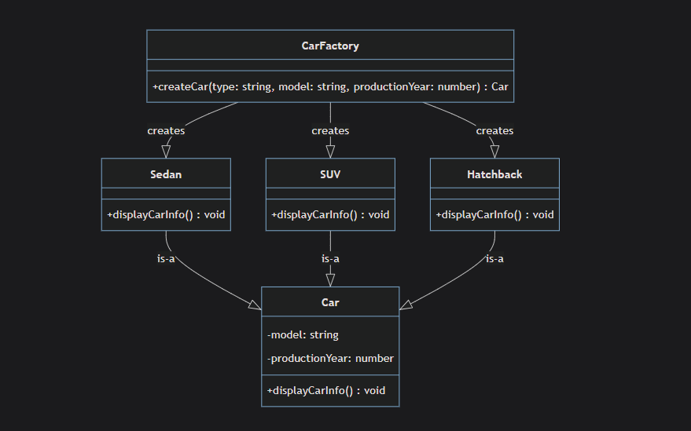
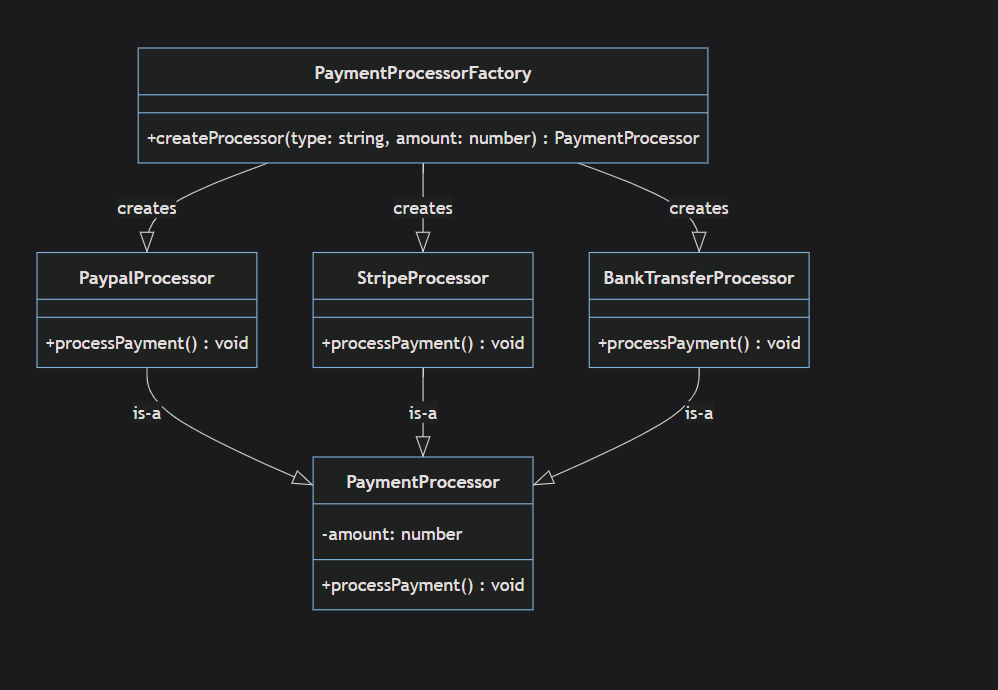
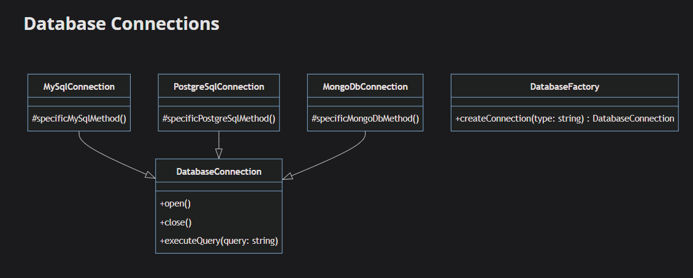
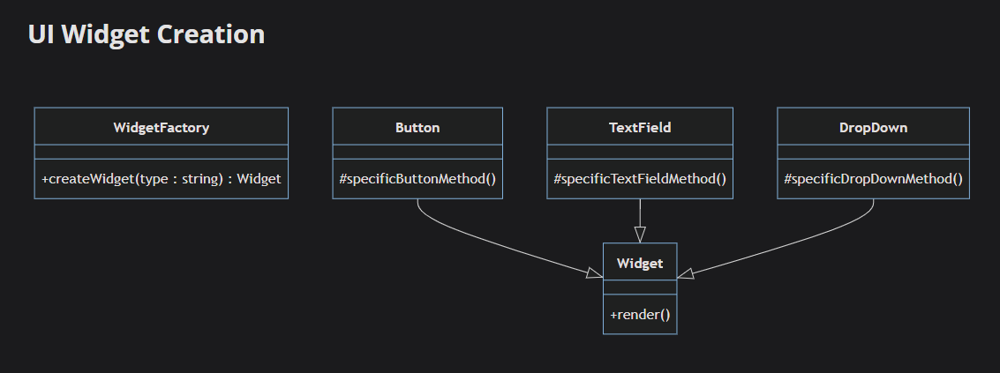
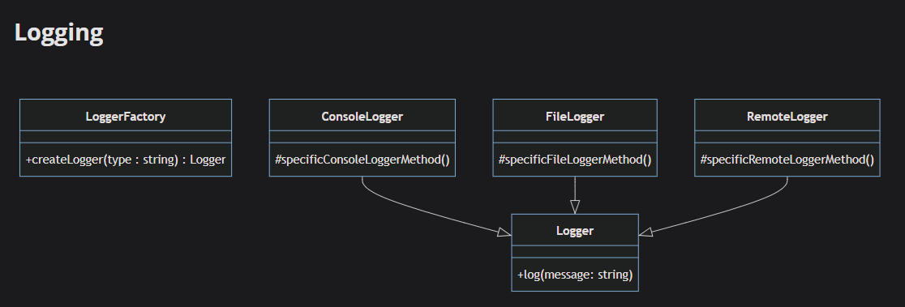

# Factory

`Factory is Creational Design Pattern that gives the subclasses a way to modify the object that will generated from their superclasses`

## Implementation

`after.ts`  


`PaymentProcessor.ts`  


**after-interface.ts**: same project sample but using interface instead of abstract class.

## Why Abstract Class Instead Of Interface?

the advantage of using an abstract class over an interface is the ability to include a constructor and the ability to define default behavior that can be reused by subclasses.

**Constructor**: An interface does not have a constructor. This means you can't control the construction of the objects that implement it. On the other hand, abstract classes can have constructors, allowing you to define and enforce a certain way of creating objects. In this case, each Car must be created with a model and a productionYear, which can be enforced by the abstract Car class constructor.

## When To Use

`The Factory Method pattern is often used in situations where a class cannot anticipate the type of objects it needs to create.`

1- **Uncertain Object Types**: If your software is supposed to create different types of objects, and you don't know what these objects will be until runtime, you may need a Factory Method as in `after.ts`.

2- **Similar Classes**: If you're dealing with a large number of classes that share a common superclass and you often need to instantiate one of these classes, but you don't know ahead of time which one you'll need to instantiate, a Factory Method can be useful.

_Example_: Consider a payment processing system where you have multiple payment methods (CreditCard, PayPal, BankTransfer, Cryptocurrency, etc.) that all inherit from a common `PaymentMethod` base class. At runtime, the user selects their preferred payment method, but your code doesn't know which specific payment class to instantiate until that selection is made.

```typescript
// Common superclass
abstract class PaymentMethod {
  abstract processPayment(amount: number): void;
}

// Similar classes sharing the superclass
class CreditCardPayment extends PaymentMethod {
  processPayment(amount: number): void {
    console.log(`Processing ${amount} via Credit Card`);
  }
}

class PayPalPayment extends PaymentMethod {
  processPayment(amount: number): void {
    console.log(`Processing ${amount} via PayPal`);
  }
}

class BankTransferPayment extends PaymentMethod {
  processPayment(amount: number): void {
    console.log(`Processing ${amount} via Bank Transfer`);
  }
}

// Factory Method - decides which class to instantiate at runtime
class PaymentFactory {
  static createPayment(type: string): PaymentMethod {
    switch (type) {
      case "creditcard":
        return new CreditCardPayment();
      case "paypal":
        return new PayPalPayment();
      case "banktransfer":
        return new BankTransferPayment();
      default:
        throw new Error("Unknown payment method");
    }
  }
}

// Usage - we don't know which payment method until runtime

// File 1: checkout.ts - No changes needed!
class CheckoutService {
  processOrder(amount: number, paymentType: string) {
    const payment = PaymentFactory.createPayment(paymentType);
    payment.processPayment(amount);
  }
}

// File 2: refund.ts - No changes needed!
class RefundService {
  processRefund(amount: number, originalPaymentType: string) {
    const payment = PaymentFactory.createPayment(originalPaymentType);
    // Refund logic...
  }
}
```

Without the Factory Method, you'd need to use multiple `if-else` or `switch` statements scattered throughout your code, making it harder to maintain and extend when new payment methods are added.

```typeScript
// File 1: checkout.ts - User making a purchase
class CheckoutService {
  processOrder(amount: number, paymentType: string) {
    // Switch statement #1 - HERE
    let payment: PaymentMethod;
    switch (paymentType) {
      case "creditcard":
        payment = new CreditCardPayment();
        break;
      case "paypal":
        payment = new PayPalPayment();
        break;
      case "banktransfer":
        payment = new BankTransferPayment();
        break;
      default:
        throw new Error("Unknown payment method");
    }
    payment.processPayment(amount);
  }
}

// File 2: refund.ts - Processing refunds
class RefundService {
  processRefund(amount: number, originalPaymentType: string) {
    // Switch statement #2 - DUPLICATED HERE
    let payment: PaymentMethod;
    switch (originalPaymentType) {
      case "creditcard":
        payment = new CreditCardPayment();
        break;
      case "paypal":
        payment = new PayPalPayment();
        break;
      case "banktransfer":
        payment = new BankTransferPayment();
        break;
      default:
        throw new Error("Unknown payment method");
    }
    // Refund logic...
  }
}

```

What Happens When You Add a New Payment Method?
Imagine you need to add CryptocurrencyPayment. Without a Factory, you must update every switch statemen\*\*t:

3- **Replacing Direct Object Construction**: If you see code that's directly constructing instances of a class, this might be a code smell suggesting that a Factory Method could be used. Directly constructing objects can make code more brittle, harder to test, and less flexible.

```typeScript
// ❌ BAD: Direct object construction scattered everywhere
class OrderService {
  processOrder(orderData: any) {
    // Directly creating database connection
    const db = new MySQLDatabase("localhost", "user", "password");

    // Directly creating logger
    const logger = new FileLogger("/var/log/app.log");

    // Directly creating email service
    const emailService = new SMTPEmailService("smtp.example.com");

    // Business logic
    db.save(orderData);
    logger.log("Order processed");
    emailService.sendConfirmation(orderData.customerEmail);
  }
}

//UserService

//ProductService

```

Problem: Your boss says "We need to switch to PostgreSQL instead of MySQL."
What you have to do:
Find every file that has new MySQLDatabase
Change it to new PostgreSQLDatabase in 23 different places
Update connection strings in 23 places
Test all 23 places
Risk missing one and breaking the app
Time: Hours of work, high chance of errors

```typeScript
// ✅ GOOD: Factory handles object creation
class DatabaseFactory {
  static createDatabase(): Database {
    // Could read from config, environment variables, etc.
    const dbType = process.env.DB_TYPE || "mysql";

    switch (dbType) {
      case "mysql":
        return new MySQLDatabase("localhost", "user", "password");
      case "postgresql":
        return new PostgreSQLDatabase("localhost", "user", "password");
      case "mongodb":
        return new MongoDBDatabase("localhost", "user", "password");
      default:
        throw new Error("Unknown database type");
    }
  }
}

// Now services use factories - much cleaner!
class OrderService {
  processOrder(orderData: any) {
    const db = DatabaseFactory.createDatabase();
    const logger = LoggerFactory.createLogger();
    const emailService = EmailServiceFactory.createEmailService();

    db.save(orderData);
    logger.log("Order processed");
    emailService.sendConfirmation(orderData.customerEmail);
  }
}

```

Solution: Your boss says "Switch to PostgreSQL."
What you do:
Change process.env.DB_TYPE = "postgresql" (or update the factory once)
Done!
Time: 30 seconds, no risk of missing anything

4- **Complexity Hiding**: When object creation is complex or involves a lot of logic (for example, setting up and connecting several different objects), a Factory Method can hide this complexity and provide a simpler interface for object creation.

5- **Conditional Object Creation**: If your code involves conditional creation of objects based on certain parameters or environmental conditions, a Factory Method can encapsulate this conditional logic and make your code easier to read and maintain.

## Advantages

**Factory Method Advantages**: (Factory Method only rather than the whole design pattern)

- A method for creating instances of class.
- A static method that creates instance of classes that's in it.
- A method the returns instance of object that meets certain criteria.

1- **Decoupling**: The Factory Pattern decouples the client code in the application from the concrete classes that are instantiated.

```typeScript
factory.createProcessor(100, "PayPal").processPayment();
```

the client code doesn't need to know anything about how different payment processors are instantiated. It only needs to call the factory's createProcessor method.

2- **Flexibility**: Factory Pattern provides flexibility when adding new types of objects. If we need to add a new payment processor in the future, we can simply add a new class for it and update the factory without affecting the existing client code.

3- **Encapsulation**: The Factory Pattern encapsulates the details of object creation. The Factory is responsible for knowing which concrete classes the system can instantiate, and how to instantiate them.

## Disadvantages

1- **Complexity**:The use of the Factory Pattern can lead to additional complexity, particularly in smaller projects or cases where a class will only ever have one type. The additional abstraction can overcomplicated the architecture of your application and make it harder to follow the logic.

2- **Refactoring**: If you already have a large codebase and want to introduce the Factory Pattern, refactoring might become a challenge. Changing direct instantiation to use a factory can involve modifying a significant amount of code.

3- **Hidden Types**: In the example `PaymentProcessor.ts`, "_paypalProcessor_" is typed as a "_PaymentProcessor._"  
This abstraction is beneficial because it decouples your code, makes it more modular, and easier to change in the future.  
However, if the different subclasses have unique methods not present in the base "_PaymentProcessor_" class, you won't be able to call them without type checking or type casting. For example, if only "_PayPalProcessor_" had a method "_PayPalSpecificMethod()_", you wouldn't be able to call that method without explicitly checking that you're dealing with a StripeProcessor.

4- **Increased Number of Classes**:
In a simpler design without the Factory Pattern, you might directly instantiate the specific PaymentProcessor objects where needed, like this:

```typeScript
let paypalProcessor = new PaypalProcessor(100);
let stripeProcessor = new StripeProcessor(200);
```

However, when we introduce the Factory Pattern, we add an additional class, "_PaymentProcessorFactory_"

```typeScript
class PaymentProcessorFactory {
  public createProcessor(type: string, amount: number): PaymentProcessor {
    switch (type) {
      case "Paypal":
        return new PaypalProcessor(amount);
      case "Stripe":
        return new StripeProcessor(amount);
      default:
        throw new Error("Invalid payment processor type");
    }
  }
}
```

Now, you have four classes: "_PaymentProcessor_", "_PaypalProcessor_", "_StripeProcessor_", and "_PaymentProcessorFactory_".

This increases the number of classes in the application, adding to the overall complexity. More classes can potentially make the code harder to manage, understand, and test, especially for developers who are new to the codebase.

5- **Testing**:
While Factory Pattern generally helps to write easily testable code by abstracting the creation logic, it can sometimes complicate the testing process if the factories are complex. The test setup might require more work, as now you need to take care of the factory setup as well.

## UseCases

1- **DataBase Connection**:  
  
Consider an application where you need to support multiple types of databases (like MySQL, PostgreSQL, MongoDB, etc.). Using a factory, you can abstract the creation of database connections.

2- **Widget UI Creation**:  

Imagine you're building a UI library, and you have different widgets like buttons, text fields, drop-downs, etc. You could use a factory to create these widgets.

Why Factory Pattern here?
Each widget might have a different construction process, but once created, they might be used in a similar way. Using the Factory Pattern hides these construction differences from the rest of the application, making it easier to add or modify widgets without affecting the rest of the code.

3- **Logging**:
  
Let's say you're developing an application where you need to support different types of logging (to console, to a file, to a remote server, etc.). A factory can be used to create the appropriate logger based on some configuration.

Why Factory Pattern here?
The Factory Pattern would allow the application to decouple the specific logging mechanism from the rest of the application. The rest of the application just needs to call log(), and it doesn't need to know where the logs are being written.
