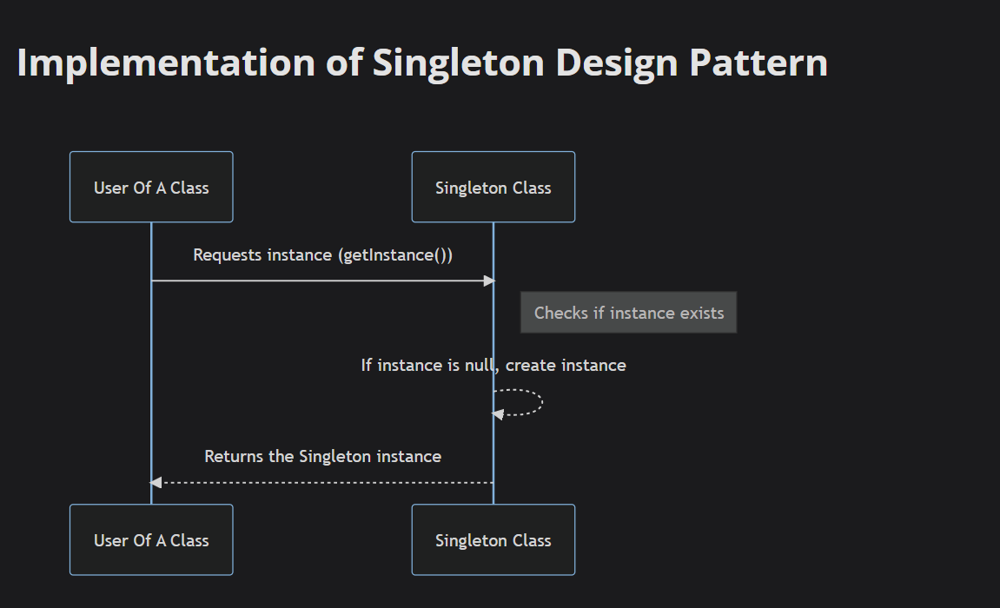
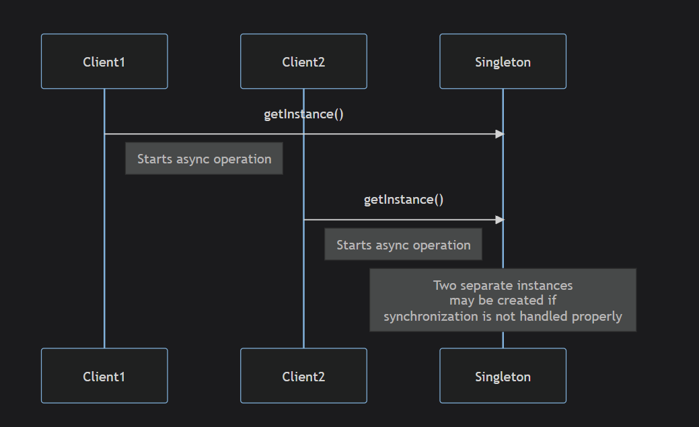
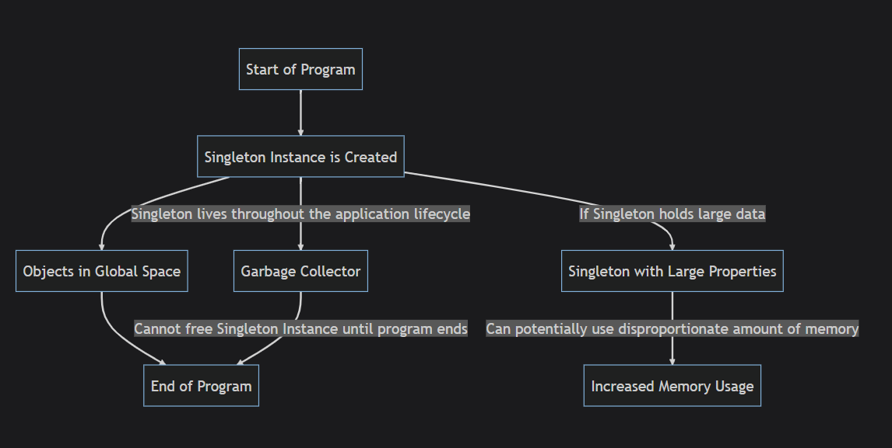
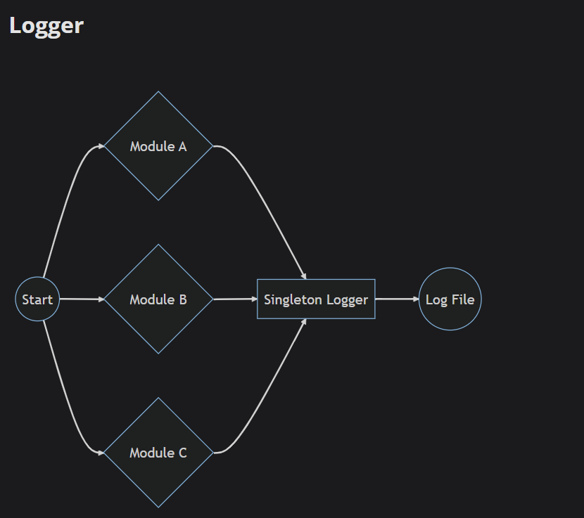
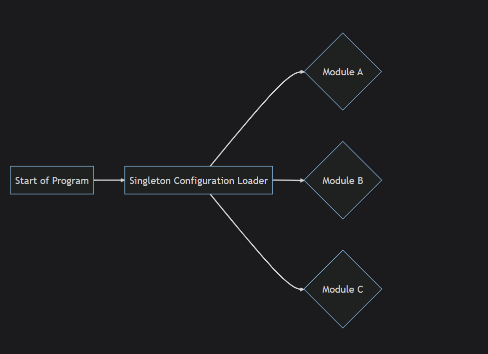
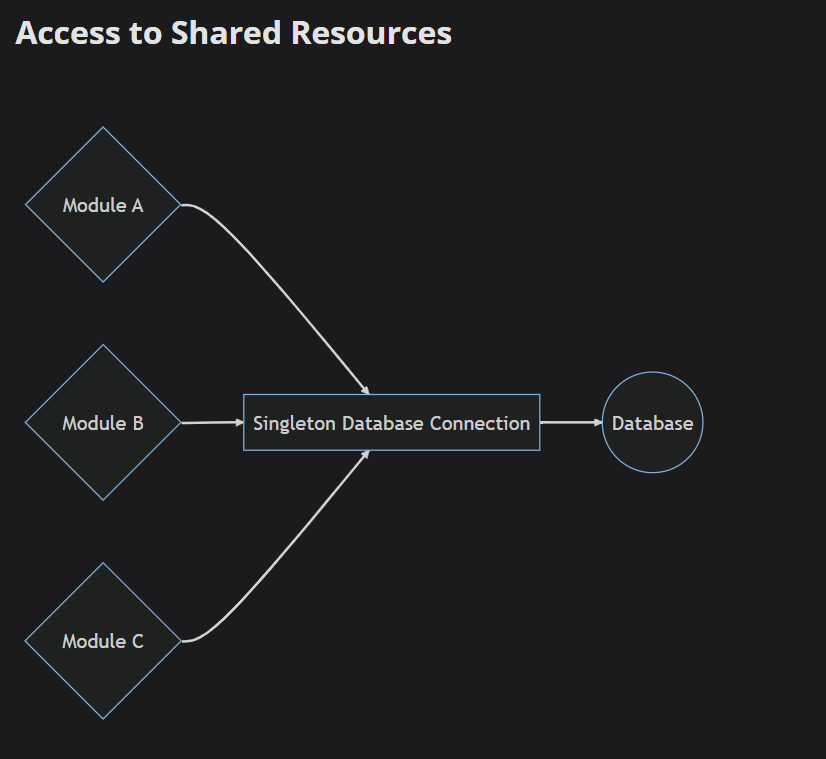
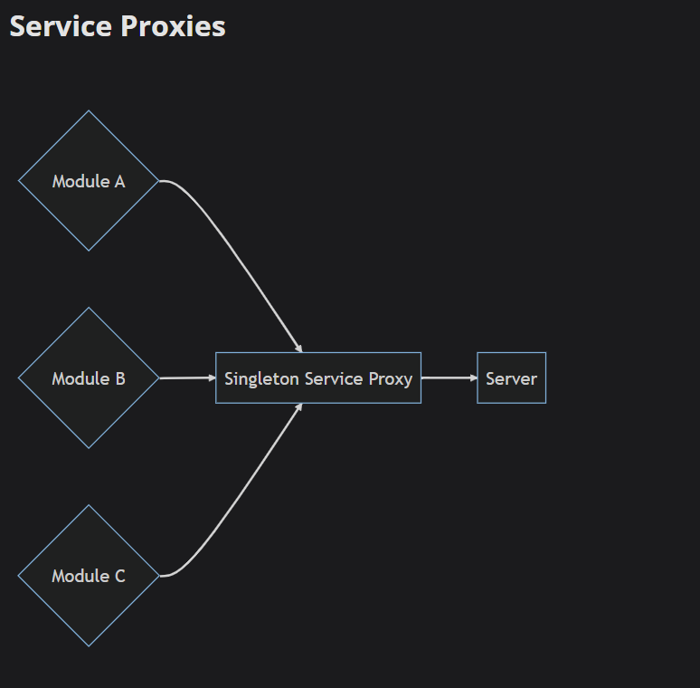
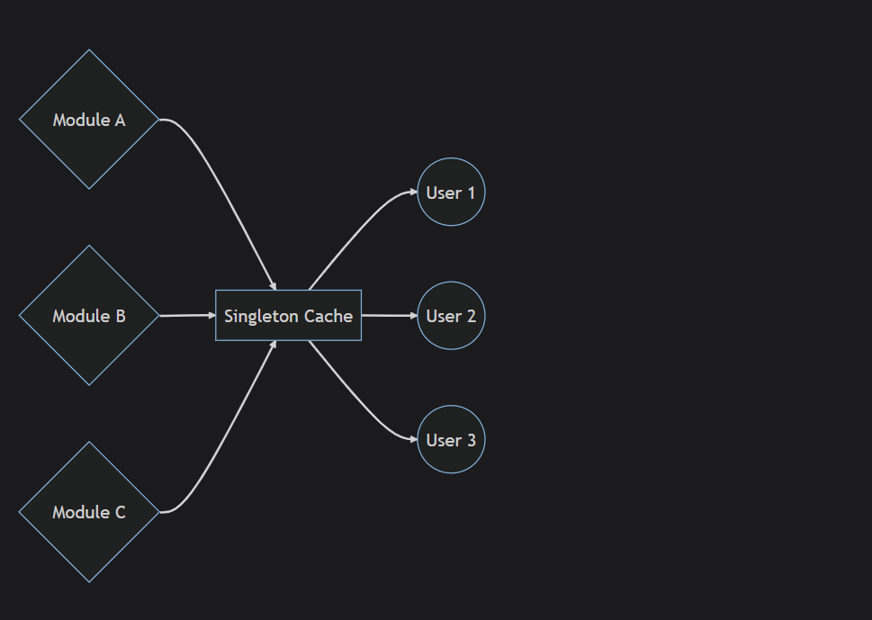

# Signleton

`Singleton is Creational Design Pattern that gives a way you to make an object of class has only one instance , and provides global access point to the instance`

## Implementation Of Singleton



1- Create Private Static Attribute Of Signleton Class

2- Create Public Access Point to the Singleton Instance (Public Static Method), this method responsible for creating the Singleton instance if does not exist

3- Constructor of class is private so not be used

## When To Use

1- **Global Variables**: If you notice that you're using a global variable to keep some data that should be accessible by many different parts of your system, a Singleton might be an appropriate way to encapsulate that see `useCases/UserCount.ts`.

2- **Repeated Initialization**: if have object that needs to be created repeatedly (like reading configuration data from a file, setting up a database connection), it might be a good idea to use a Singleton

3- **Multiple Access, Single Control**:if have shared resource like "_Cookies_" or "_widely used systems_" that modified and accessed from different parties , singleton is good choice.

4- **Non-Uniform Access**: means different parts of your code access the same resource in different ways - some create new instances, some pass it around, some use different methods. This creates inconsistency and confusion, encapsulating that resource into a Singleton can make its use more predictable and manageable see `useCases/DataBase.ts`.

5-**Duplicate Instances**: If you observe that your system is generating multiple instances of an object, and each of those instances is identical and they do not maintain distinct state, you may want to consider the Singleton pattern.

6- **Excessive Parameters**: If you're passing an instance of an object through several layers of your program just to make it available to a deeply nested component, consider whether this might be a sign that the object could be a Singleton see `useCases/logger.ts`.

## Advantages

`The Advantages are all related to Logger.ts`

1- **File Access Issues**: Concurrency is the main issue , since 2 loggers might write to the file at same time causing data lose or one logger might over write another

2 -**Performance**: Opening and closing file connections are resource-intensive operations. If each logger opens its file connection, it can put unnecessary stress on the system resources. A single instance sharing the same file connection can be more efficient.

3- **Consistency**: By having a single instance, you can ensure that all parts of your application use the same logging format and write to the same place.

4- **Configuration**: If each part of your application uses a separate logger, and you want to change something about the logging (like the log format or log level), you would have to find and change every instance of the logger. With a singleton, there's only one place you need to change.

## Disadvantages

1- **Global State**:
The Singleton pattern is essentially a globally shared instance, leading to a state that's shared across the entire application. This can make code harder to reason about and can increase the coupling between classes, leading to less modular code.

2-**Testing Difficulty**:
Because the singleton object maintains its state throughout the lifetime of the program, it can create problems when writing tests, as the state is preserved between tests, possibly causing unexpected results.

```TypeScript
describe("Logger", () => {
  it("should log messages", () => {
    const logger = Logger.getInstance();
    const spy = jest.spyOn(console, "log");
    logger.log("Test message");
    expect(spy).toHaveBeenCalledWith("[<timestamp>] - Test message");
  });

  it("should log different messages", () => {
    const logger = Logger.getInstance();
    const spy = jest.spyOn(console, "log");
    logger.log("Another test message");
    expect(spy).toHaveBeenCalledWith("[<timestamp>] - Another test message");
  });
});
```

The problem here is that the Logger instance is shared between tests. If one test modifies the Logger (for example, if Logger had a method to change the log level or format), it could affect the other tests. This goes against the principle that each test should be isolated and independent.

In real-world scenarios, the problems can be more complex. For example, if our Logger was logging messages to a file or a database, it could leave some data behind that affects the next test. Cleaning up (resetting the state) after each test can be complicated and error-prone.

Furthermore, it becomes challenging to test the behavior of your code under different conditions. For example, if you wanted to test how your code behaves when the logger fails or behaves unexpectedly, it's difficult to replace the singleton instance with a mock or a faulty implementation for a single test.

3- **Concurrency Issues**:
Concurrency happened in multi-threaded programming languages , meanwhile typescript is based on javascript which is single threaded thus caution must be taken to javascript asynchronous-event-driven nature, non-blocking I/O model.

While JavaScript (and thus TypeScript) is inherently single-threaded, it supports concurrency through an event-driven, non-blocking I/O model. This is where we get concepts like callbacks, promises, and async/await in JavaScript. So, while we don't have to worry about multiple threads executing code at the exact same time (as we would in a multi-threaded language), we do have to think about multiple operations happening concurrently and potentially causing unexpected behavior.

```typeScript
class Logger {
  private static instance: Logger;

  private constructor() {}

  public static async getInstance(): Promise<Logger> {
    if (!Logger.instance) {
      // Simulating a delay with a Promise that resolves after 1 second
      await new Promise((resolve) => setTimeout(resolve, 1000));
      Logger.instance = new Logger();
    }
    return Logger.instance;
  }

  public log(message: string): void {
    const timestamp = new Date();
    console.log(`[${timestamp.toLocaleString()}] - ${message}`);
  }
}
```

```typeScript
async function main() {
  const [logger1, logger2] = await Promise.all([
    Logger.getInstance(),
    Logger.getInstance(),
  ]);
  console.log(logger1 === logger2); // Will print 'false'
}

main();
```

In this case, because the getInstance() function is asynchronous and includes a delay before the instance is created, both calls to getInstance() will see that Logger.instance is not yet defined, and they will both create a new instance. So we end up with two separate instances of our supposed Singleton.

4- **Subclassing**:
The singleton pattern fundamentally doesn't play well with inheritance. It's a pattern designed to ensure that there's only one instance of a specific class, which goes against the idea of creating a hierarchy of classes and instances.

```typeScript
class Logger {
  private static instance: Logger;

  private constructor() {}

  public static getInstance(): Logger {
    if (!Logger.instance) {
      Logger.instance = new Logger();
    }
    return Logger.instance;
  }

  public log(message: string): void {
    const timestamp = new Date();
    console.log(`[${timestamp.toLocaleString()}] - ${message}`);
  }
}

class FileLogger extends Logger {
  public log(message: string): void {
    const timestamp = new Date();
    // hypothetical method to write to a file
    this.writeToFile(`[${timestamp.toLocaleString()}] - ${message}`);
  }

  private writeToFile(message: string): void {
    // logic to write message to a file
  }
}

// Trying to get a FileLogger instance
const logger = FileLogger.getInstance();
logger.log("Test message");
```

In this case, TypeScript will throw an error at compile time, because FileLogger.getInstance() is trying to return an instance of Logger, not FileLogger. This is an inherent issue with the Singleton pattern: because the getInstance method is tied to the specific class (in this case, Logger), you can't use it to create instances of a subclass.

5- **Overuse and Misuse**:
Singleton is often overused by developers. Not every situation where having a single instance can be beneficial, warrants a singleton pattern. Singleton should not be used to replace global variables just because globals are considered bad. Misuse of Singleton can lead to problems related to tight coupling and difficulties in testing.

6- **Memory Management**:
Once an instance of a singleton class is created, it remains in memory until the application is shut down. This could potentially be an issue if the singleton instance uses a lot of resources.

Regarding memory management, TypeScript and JavaScript automatically manage memory using garbage collection, which means that unused objects are automatically deallocated. However, because a singleton is intended to live for the duration of the application, its memory is not freed until the program ends. This is typically not a problem, as long as the Singleton doesn't use a disproportionate amount of resources, but it's still something to be aware of.


If the Singleton does hold onto a large amount of data, it could potentially cause memory-related issues. It's up to the developer to ensure that the Singleton does not unnecessarily consume resources while it is alive.

## Applications

1- **Logger**:  


2- **Configuration Data**:  
  
In a complex application, you might have configuration settings that control various aspects of the application's behavior. These settings might be stored in a configuration file, a database, or a remote server. To avoid the overhead of fetching these settings every time they're needed, you can use a singleton Configuration class to load the settings when the application starts, and then provide access to them for the rest of the application.

3- **Shared Resource**:  


4- **Service Proxies**:  
  
If your application communicates with a remote server - for example, to fetch data, submit updates, or perform other operations - it's often more efficient to have a single ServiceProxy class manage all the communication. This can avoid the overhead of establishing a new network connection for each operation, and it can also handle things like queuing operations if the server is busy, retrying operations if the server is unavailable, and so forth.

5- **Caching**:  
  
Caching is a common technique to improve performance by storing the results of expensive operations, so that if the same operation is requested again, the result can be returned from the cache instead of repeating the operation. A singleton Cache class can ensure that all parts of the application are using the same cache, so that they can share results and avoid duplicating effort. If there were multiple caches, an operation that had been cached by one part of the application might be needlessly repeated by another part of the application because it didn't have access to the same cache.
