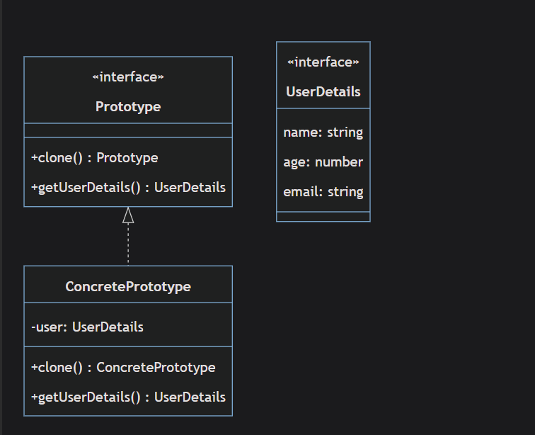
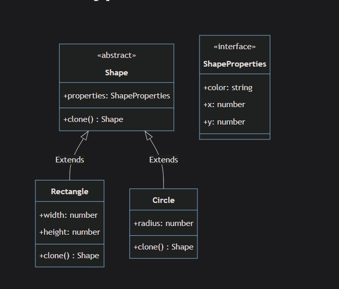
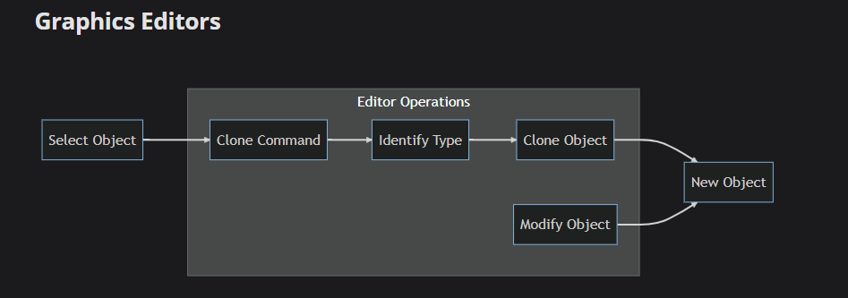
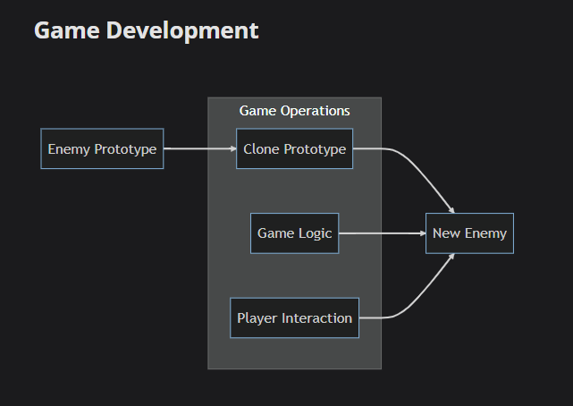
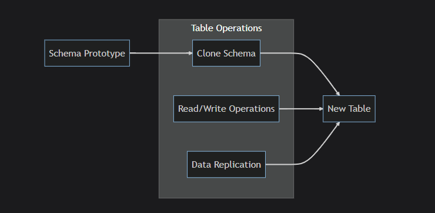
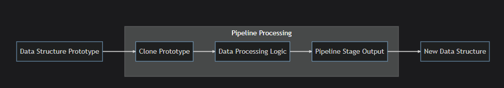
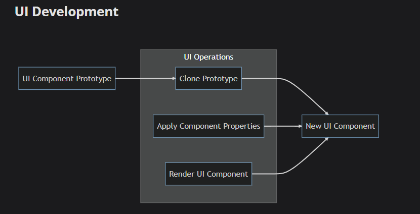

# Prototype

`Prototype is creational design pattern that allows you to copy complex objects, without coupling to their classes, prototype gives you interface to copy objects even when there classes are unknown`

`Prototype objects can produce full copies since objects of the same class can access each other's private fields.`

## Implementation

`after.ts`  

`Shape.ts`  


## What To Consider

`How can you identify when to use the Prototype pattern?` A programmer could consider the following aspects:

1- **Consider the initialization process**: If creating a new object involves heavy computations, network/database calls, or other expensive operations, it could be a good signal that the Prototype pattern might be a viable solution.

2- **Look at the object states**: If you frequently need to create copies of objects while preserving their state, the Prototype pattern would be a good fit.

3- **Pay attention to the structure of your classes**: If your classes are quite complex, with multiple subclasses or dependencies, the Prototype pattern can simplify the process of creating new instances.

## When To Use

1- **Complex Object Creation**: If you have a system where object creation is complex (due to complex initialization, large numbers of attributes, or other factors) and you find that many similar objects need to be created, the Prototype pattern could be useful. Instead of repeating the complex construction process for each new object, you could clone a prototype.

2- **High Cost of Object Creation**: If you have a situation where creating each object from scratch is expensive in terms of memory or CPU (for example, if creating an object involves a database query), using the Prototype pattern allows you to clone a pre-loaded object, which can be more efficient.

3- **Similar Object Instances**: If you need multiple objects that are similar ( but not identical) to an existing instance, you might consider the Prototype pattern. After cloning the object, you can modify the clone to achieve the necessary differences.

4- **Dynamic Typing or Run-time Configuration**: If the exact type or state of objects your system needs can only be determined at runtime, the Prototype pattern could be useful.

5- **Preserving Historical States**: If you are creating an application where you need to save the state of an object and be able to go back to it later ( for example, for an undo feature in a text editor or for a save/load game feature), the Prototype pattern can help.

6- **Large Object Graphs**: If your application works with large object graphs ( for example, complex data structures), and if a user's action might result in a small change to the graph, it can be more efficient to clone the entire graph and modify the clone rather than recreating the graph for each action.

## Advantages

1- **Avoid Reference Errors**: In JavaScript and TypeScript, when you assign an object to a new variable, you're actually assigning a reference to the original object, not creating a completely new object. This means if you modify the new object, you're also modifying the original object. This is often a source of bugs and can lead to reference errors.

```typeScript
let original = { name: "John" };
let copy = original;
copy.name = "Jane"; // This also changes 'original'

console.log(original.name); // Outputs 'Jane', not 'John'

```

The Prototype pattern, when used with deep cloning, can help avoid this problem.

2- **Efficient Object Cloning**: If creating a new object involves a heavy database read or computation, cloning an existing object can save these resources.It allows you to clone complex objects without coupling to their concrete classes.
In the Shape example, we can clone any shape regardless of its concrete class

3- **Efficient Adding and Removing Properties at Runtime**:You can save resources when the creation of a new object is resource-intensive.Let's say calculating the area of the shape is a computationally expensive operation which happens during the initialization of the object. Once we have a created shape, we can simply clone it to create a similar object without incurring the computational cost associated with calculating the area again

4- **Simplify Object Creation**:It can simplify object creation in systems with complex object relationships or configurations. When objects are composed of several interconnected parts, cloning can help ensure these connections are maintained without having to reconstruct them manually.

## DisAdvantages

1- **Shallow vs Deep Copying**: As it has explained before , "_TypeScript_" as well as "_JavaScript_" creates shallow copy of objects (new copied object referenced to the object that has copied from)

```TypeScript
let original = {
  name: "John",
  address: {
    street: "123 Main St",
    city: "New York",
  },
};

```

```TypeScript
let shallowCopy = { ...original };
```

```TypeScript
shallowCopy.address.city = "Los Angeles";

//You'll see that the original object is also modified:
console.log(original.address.city);
// Outputs 'Los Angeles'
```

Now, let's consider a deep copy. A simple way to make a deep copy in JavaScript is to use JSON.parse and JSON.stringify:

```TypeScript
let deepCopy = JSON.parse(JSON.stringify(original));
deepCopy.address.city = "San Francisco";
console.log(original.address.city);
// Outputs 'Los Angeles'

```

2- **Problems With JSON.parse and JSON.stringify**:Again, using JSON.parse and JSON.stringify for deep copying is a simple but limited approach, as it only works with JSON-compatible data. It won't correctly copy complex objects such as those with function properties, Date objects, or circular references. For complex cases, you might need a more sophisticated approach or a library specifically designed for deep cloning.
The typical ways to deep clone objects in JavaScript were:
Using `JSON.parse(JSON.stringify(obj))` for JSON-safe objects.
Using `recursion` to manually copy each property for more complex objects.
Using a library like `lodash's _.cloneDeep()` method, which handled a wide range of edge cases.
However, with the introduction of the structured cloning algorithm in JavaScript, we can now use the `structuredClone()` method to deep clone.

3- **Resource-intensive operations**:If an object requires a lot of resources for cloning, using the Prototype pattern might not be efficient. Cloning an object might involve constructors, which could be a costly operation depending upon what's happening in the constructor.

there's no contradiction with point number 2 in **advantages** here's why

```TypeScript
//Scenario 1: Cloning is Better ✅
class DatabaseUser {
  private userData: any;
  private permissions: any;
  private settings: any;

  constructor(userId: string) {
    // ❌ EXPENSIVE: Database queries during creation
    this.userData = fetchUserFromDatabase(userId);        // 500ms
    this.permissions = fetchUserPermissions(userId);     // 300ms
    this.settings = calculateUserSettings(this.userData); // 200ms
    // Total: 1000ms to create
  }

  clone(): DatabaseUser {
    // ✅ CHEAP: Just copy existing data
    const clone = Object.create(this);
    clone.userData = { ...this.userData };     // 5ms
    clone.permissions = { ...this.permissions }; // 2ms
    clone.settings = { ...this.settings };    // 3ms
    // Total: 10ms to clone
    return clone;
  }
}

// Creating from scratch: 1000ms
// Cloning: 10ms
// Winner: Cloning! 🎉

```

```TypeScript
//Scenario 2: Creating is Better ✅
class SimpleUser {
  constructor(public name: string, public age: number) {
    // ✅ CHEAP: Simple creation
    // Total: 1ms to create
  }

  clone(): SimpleUser {
    // ❌ EXPENSIVE: Complex cloning logic
    const clone = JSON.parse(JSON.stringify(this)); // 50ms (serialization overhead)
    // Or custom deep cloning with validation: 100ms
    // Total: 50-100ms to clone
    return new SimpleUser(clone.name, clone.age);
  }
}

// Creating from scratch: 1ms
// Cloning: 50-100ms
// Winner: Creating from scratch! 🎉

```

<u> Solutions for resource-intensive operation problem</u>

`Yes, there are several strategies you can use to avoid resource-intensive operations during object cloning with the Prototype pattern.`

1- **Lazy Copy**: This strategy involves deferring the copying of internal objects until they're needed. If an internal object is never modified, you don't need to create a separate copy for the cloned object, and both can share the original object.

2- **Copy-on-write**: This strategy is a variation of the lazy copy. It doesn't actually copy internal objects until they're modified. When a cloned object tries to modify an internal object, it first checks whether it's shared with the original object. If it is, it makes a copy before modifying it. This avoids unnecessary copying if the internal objects aren't modified.

3- **Shared references**: If your data doesn't change, or if it's okay for clones to share some data, you can keep a reference to the original data in your cloned objects. This allows you to save resources by sharing large, complex, or computation-intensive resources between clones.

```TypeScript
interface IPrototype {
  clone(): IPrototype;
}

class DatabaseData implements IPrototype {
  private data: any;

  constructor(data: any) {
    this.data = data;
  }

  clone(): IPrototype {
    // Creating a new instance that shares the same data reference.
    let clone = new DatabaseData(this.data);
    return clone;
  }
}

class DatabaseRecord {
  data: DatabaseData;

  constructor(id: number) {
    // Assume that getDataFromDatabase is a costly operation, like a database query.
    this.data = this.getDataFromDatabase(id) as DatabaseData;
  }

  getDataFromDatabase(id: number): IPrototype {
    // Simulating a database operation...
    console.log(`Querying database for record with id ${id}`);
    return new DatabaseData({ id: id, value: "Some data" });
  }
}

let original = new DatabaseRecord(1);
let cloneData: DatabaseData = original.data.clone() as DatabaseData;

console.log(cloneData); // Outputs { id: 1, value: 'Some data' }
```

While this approach provides a way to manage resource-intensive data and its duplication, it's important to note that it introduces a high degree of coupling between the DatabaseRecord and DatabaseData classes. Such tight coupling could make the code less flexible and harder to maintain, especially in larger systems.

But remember, these strategies aren't perfect solutions for every situation. They're suitable when certain conditions are met, such as when data doesn't change frequently, or when it's acceptable for cloned objects to share some or all of their data with the original object. The best strategy depends on the specific requirements and constraints of your project.

4 -**Complexity with custom clone methods**:
"Complexity with custom clone methods," refers to situations where the cloning operation might not be as straightforward as duplicating all properties of an object.
This could happen if some of the properties should not be cloned, or if the object contains cyclical references, or when the object's properties are instances of classes that also need to be cloned.

for example

```TypeScript
interface IPrototype {
  clone(): IPrototype;
}

class ComplexObject implements IPrototype {
  simpleProp: string;
  complexProp: ComplexSubObject;

  constructor(simpleProp: string, complexProp: ComplexSubObject) {
    this.simpleProp = simpleProp;
    this.complexProp = complexProp;
  }

  clone(): IPrototype {
    // We can't simply clone all properties, as complexProp needs to be cloned as well.
    let clone = new ComplexObject(
      this.simpleProp,
      this.complexProp.clone() as ComplexSubObject
    );
    return clone;
  }
}

class ComplexSubObject implements IPrototype {
  someProp: string;

  constructor(someProp: string) {
    this.someProp = someProp;
  }

  clone(): IPrototype {
    let clone = new ComplexSubObject(this.someProp);
    return clone;
  }
}

```

<u>How Complex Object Can Look Like</u>

1- **Some properties should not be cloned**: In some scenarios, not all properties of the object need to be cloned. For example, let's say we have a unique id for each object which should not be duplicated:

```TypeScript
class UniqueIdObject implements IPrototype {
  id: number;
  data: string;

  constructor(id: number, data: string) {
    this.id = id;
    this.data = data;
  }

  clone(): IPrototype {
    // The unique id should not be cloned.
    let clone = new UniqueIdObject(Math.random(), this.data);
    return clone;
  }
}

```

2- **Cyclical references**:Cyclical references occur when an object has a property that references itself. Naive cloning methods would result in an infinite loop in this situation:

```TypeScript

class CyclicalReferenceObject implements IPrototype {
  selfReference: CyclicalReferenceObject | null;

  constructor() {
    this.selfReference = null;
  }

  clone(): IPrototype {
    let clone = new CyclicalReferenceObject();
    // WARNING: This line would cause an infinite loop!
    // clone.selfReference = this.selfReference.clone() as CyclicalReferenceObject;
    return clone;
  }
}

```

3- **Properties are instances of classes that also need to be cloned**: I actually covered this in the previous `ComplexObject` and `ComplexSubObject` example.

## Use Cases

`Sure, the Prototype pattern is frequently used in various real-world scenarios. Here are a few examples:`

"_Gray box refers to operations that operates together_"

1- **Graphics Editors**:  

Applications such as graphics editors often need to create identical copies of complex graphical objects. Instantiating such objects might involve costly operations such as fetching resources from disk, performing complex calculations, or executing other time-consuming setup procedures.
Here, the Prototype pattern comes in handy. When an object is cloned, these expensive operations aren't needed because the new object's properties are copied from an existing object.

2- **Game Development**  
  
In game development, especially in real-time strategy ( RTS) games, you often need to spawn multiple similar units or entities like soldiers, tanks, buildings, or even terrain tiles. Creating each of these from scratch could be a resource-intensive process. The Prototype pattern can be used to create a prototype of each entity type and then clone it when a new entity is required.

3- **Distributed Systems and Databases**:  
  
In distributed systems, it's common to have to replicate large amounts of data across different servers to ensure data durability and availability. If the data consists of complex objects, creating new instances can be expensive.

3- **Data Processing Pipelines**:  
  
In data processing applications, it's common to have "template" objects that serve as the starting point for a series of operations. These template objects are then cloned and modified rather than created from scratch each time. For example, you might have a template for a data record with some pre-filled fields. When a new record arrives, it's cloned from the template, and the specific fields are then updated.

4- **UI Development**:  
  
In user interface (UI) development, it's common to have similar elements across different screens or components. By creating a prototype of such UI elements, we can clone it whenever required.`React is fantastic Example of that`

## last Notes

1- **Shallow Copy Creation**: Prototype Pattern typically creates shallow copies of objects. In a shallow copy, only the top-level properties of an object are copied, meaning that any nested objects within that object are still referenced rather than duplicated.
