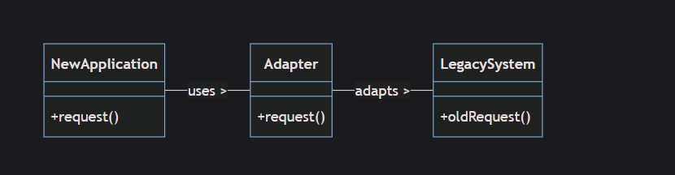
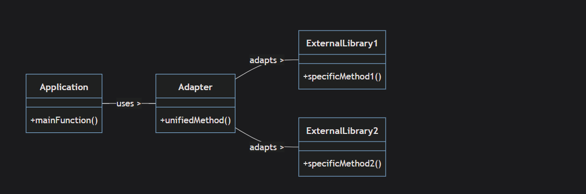

# Adapter

`Adapter is Structural Design pattern Allows incompatible interfaces (target and adaptee) to act with each others without modifying the source code`

_**Note**_: there's no implementation for _before.ts_ use case , because adapter is direct injection solution , this means there's no a state for code before using the adapter

## When to use

1- Refactoring legacy code , where you want to keep bridge between old code and new code for compatibility reasons, allowing them to work together without modifying the original legacy code refer to `real_implementation.ts`.

2- Incompatible Interface , where you want two classes to interact with each other , but they are very different , the adapter work as bridge without modifying there source code as in _after.ts_ example

3- alternative for multiple interfaces , this is only apply to typeScript since you can not inherits from two classes

4- abstract the classes that changes a lot (volatile class) [_**shield client code**_]

```typeScript
// Volatile third-party class (changes often)
class FastPayAPI {
  makePayment(amount: number, currency: string) {
    console.log(`Paid ${amount} ${currency} using FastPay`);
  }
}

// Your stable interface
interface PaymentProcessor {
  pay(amount: number): void;
}

// Adapter to shield your code from FastPayAPI changes
class FastPayAdapter implements PaymentProcessor {
  constructor(private fastPay: FastPayAPI) {}

  pay(amount: number): void {
    // Always pay in USD for your app
    this.fastPay.makePayment(amount, "USD");
  }
}

// Usage in your app (your code depends on PaymentProcessor, not FastPayAPI)
const paymentProcessor: PaymentProcessor = new FastPayAdapter(new FastPayAPI());
paymentProcessor.pay(100);
// Your code is stable, even if FastPayAPI changes
```

## Advantages

1- enabling interoperability , it means different interfaces can work
together without modifying their source code

2- Decoupling , from _real_implementations.ts_ any changes on PostgresSql class won't affect the client code, only the adapter _DataBaseAdapter_

3- Reusability and Flexibility  
_Reusability means_ the client code almost never changes after using the adapter  
_Flexibility means_ new classes (e.g SQL lite) can be added with creating small new adapter and again without modifying client code

## Disadvantage

1- Tight coupling between the adaptee `Postgres Class` and adapter `DataBaseAdapter Class` as any Change on the adaptee it would affect the adapter

2- Developers how don't know this design pattern can be confused between the adapter class and adaptee , since both are implementing same methods

3- lose some of the adaptee capabilities , since the client is relies on the adapter class some of the methods of the adaptee might be lost

## UseCases

1- legacy code , when you have new application that needs to interact with legacy code but then you want to change the legacy code latter , this way the client code won't change



2- interact with external libraries , the next example are using a combination of two external libraries together in the `unifiedMethod` of the `Adapter Class` on the other hand any changes of the interfaces for the external libraries won't effect the client code


