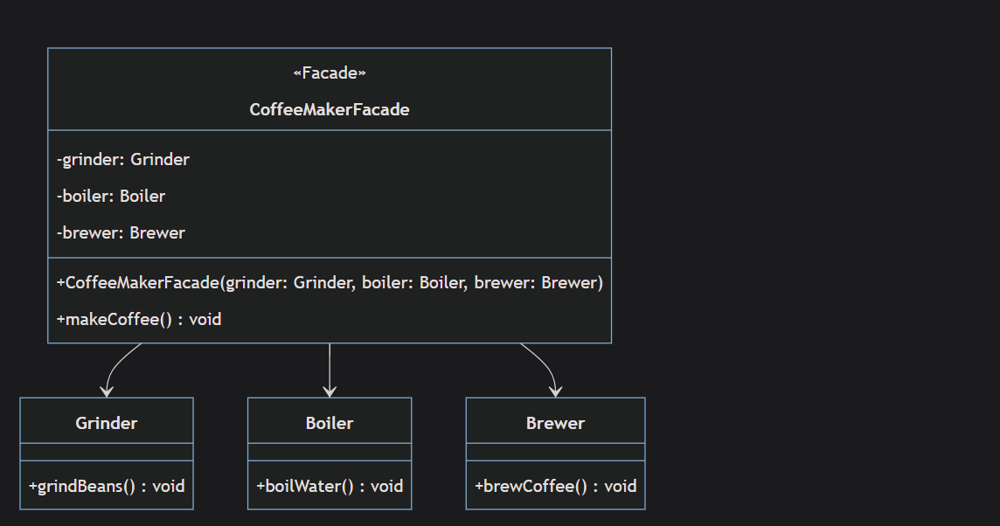
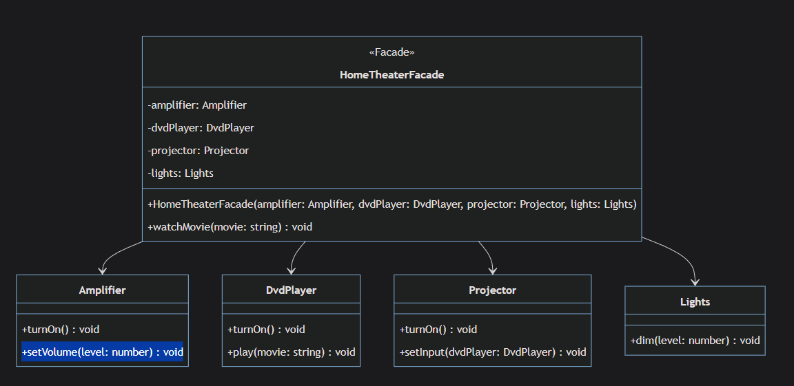
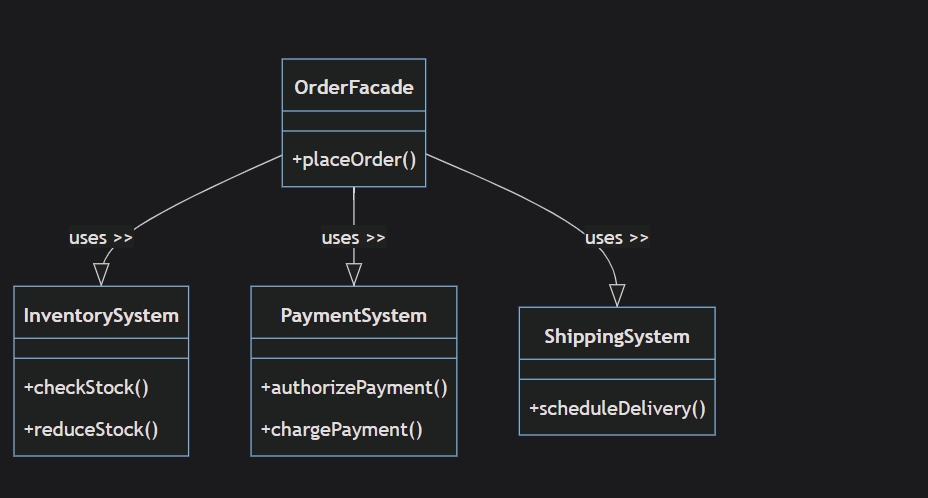
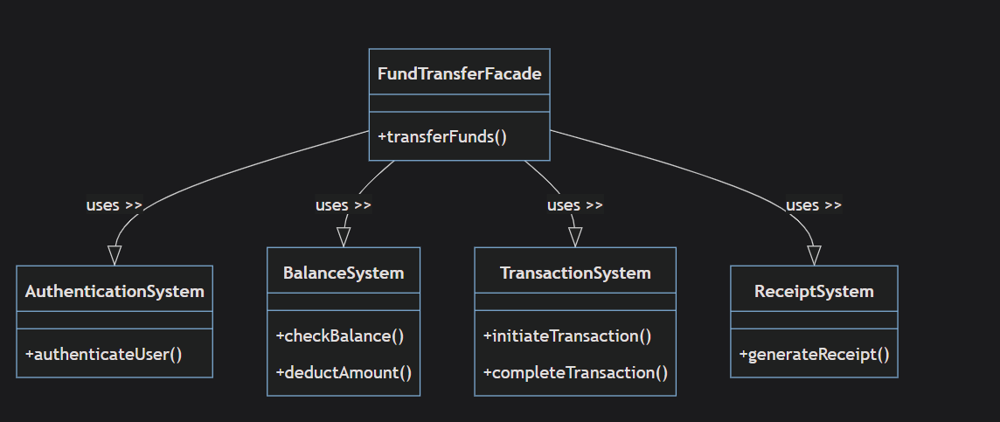
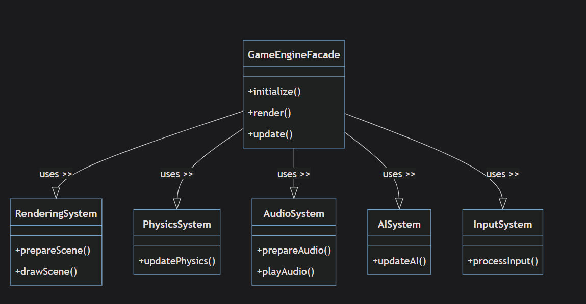

# Facade

`Structural Design Pattern that gives you simplified interface to complex systems`

## Projects

`after.ts`


`Home Theater`


## When To Use

1- **Rampant Dependencies**: this means when your code depends on too many different classes and it becomes so interfered classes.
for example in `after.ts`

```typeScript
//the code before applying the design pattern could look something like this

class CoffeeShop {  // ← CLIENT must handle everything
  private grinder: Grinder;     // ❌ Client depends on Grinder
  private boiler: Boiler;       // ❌ Client depends on Boiler
  private brewer: Brewer;       // ❌ Client depends on Brewer

  constructor() {
    // ❌ Client must create all objects
    this.grinder = new Grinder();
    this.boiler = new Boiler();
    this.brewer = new Brewer();
  }

  orderCoffee(coffeeType: string) {
    // ❌ CLIENT has the business logic
    if (coffeeType === "espresso") {
      this.grinder.grindBeans();   // Client knows the steps
      this.boiler.boilWater();     // Client knows the order
      this.brewer.brewCoffee();    // Client manages complexity
    }
  }
}


```

`while looks the same for after.ts , but this code is the actual client code , while when creating object from this class "coffeeShop" , this whole class builded from the client itself , the client has to do every thing from creating object of "grinder" , "boiler" and "brewer" with that order exactly `

`mean while in facade we could provide simple interface "orderEspresso()" that take care of this whole thing for the client`

2- **Overwhelming Complexity**: When you're dealing with a complex subsystem with multiple interdependent classes or operations, using them directly can be overwhelming and error-prone. as we saw in the previous point , the client has to deal with all classes and handle them.

3- **OverExposure of Inner Working**: Facade Design pattern can be used when you want to hide the inner working of classes
for example in `after.ts`
you want to hide how "_Boiler()_" works and how it depends on "_Grinder()_"

4- **Provide Layered Architecture**:What it means there is multi layers (tasks) to be performed in order to get the final result for example in `after.ts` "_Boiler()_" class is a layer and other classes as well and the final task which is "_makeCoffee()_" required these layers in order to get the final result another example layers can be

```typeScript
const fetchData=new FetchData()
const prepareData = new PrepareData()
const prepareUI=new PrepareUI()

const renderer=new RendererFacade()

renderer.renderComponent(fetchData,prepareData,prepareUI)
```

5- **Need for a Simplified API**: for example in `after.ts`

```typeScript
coffeeMaker.makeCoffee();
```

6- **Refactoring Legacy Code**: Legacy code can often be difficult to work with, especially when it's not feasible to refactor all at once. A Facade can be created to simplify interactions with this code, which can be a step towards its eventual refactoring. the example in first point can be applied to this point too

## Advantages

1- **Simplified Interface**: The Facade pattern provides a simplified interface to a complex subsystem.

2- **Reduced Dependencies**:"_Dependencies_" are when one class needs to know about and directly use other classes. The Facade pattern reduces these dependencies by acting as a middleman.

3- **Decoupling of Subsystems and Client**: The Facade pattern decouples the client and the subsystems. Changes in the subsystem classes have minimal effect on the client code as long as the facade's interface stays the same. For instance in `HomeTheater.ts`, if we add more methods or change the implementation within the "_Amplifier_" class, it won't affect the client code.

4- **Easier to Use & Promotes Layering**: The Facade pattern promotes a layered architecture in your code. You can use facades to define entry points to each layer of your architecture, which helps to structure and organize the code.

```typeScript
// DATA ACCESS LAYER
class DatabaseFacade {
  private userRepo: UserRepository;
  private orderRepo: OrderRepository;
  private productRepo: ProductRepository;

  getUser(id: string) { /* handles all DB complexity */ }
  saveOrder(order: Order) { /* handles all DB complexity */ }
  getProducts() { /* handles all DB complexity */ }
}

// BUSINESS LOGIC LAYER
class OrderProcessingFacade {
  private dbFacade: DatabaseFacade;
  private paymentService: PaymentService;
  private inventoryService: InventoryService;

  processOrder(orderData: OrderData) {
    // Handles all business rules and validations
    // Coordinates between different services
  }
}

class ClientApplication {
  private webAPI: WebAPIFacade;

  constructor() {
    this.webAPI = new WebAPIFacade(); // Only depends on top layer
  }

  createOrder() {
    // Client only knows about the presentation layer
    // All other layers are hidden behind facades
    this.webAPI.handleOrderRequest(request);
  }
}
```

## Disadvantages

1- **Over-abstraction**: If the underlying subsystem is relatively simple and doesn't require a simplified interface, introducing a facade might add complexity rather than reducing it.

2- **Limited Flexibility**:By using a Facade, you're limiting your access to the full functionality and flexibility of the subsystem, for example in `HomeTheater.ts` the watchMovie function is specifically designed to set up a movie-watching experience. It dims the lights, turns on the amplifier , etc ... but suppose you wanted to play a video game on the projector instead of watching a movie, or you wanted to listen to an audio CD on the amplifier without turning on the projector and dimming the lights. The watchMovie method can't handle these use cases.
In order to accomplish these tasks, you would need to bypass the facade and directly interact with the subsystem classes (Amplifier, DvdPlayer, Projector, Lights), which defeats the purpose of having the facade in the first place.

3- **Hiding Useful Information**:While encapsulating the details of complex subsystems is often useful, in some cases, it might hide information that could be beneficial for the client code.
For example in `HomeTheater.ts` the Amplifier class might have a method to adjust the audio balance, the DvdPlayer could have settings for language or subtitle preferences , etc ... in this way, while the facade makes the subsystem easier to use for the most common tasks, it can hide potentially useful information or functionality.

## Use Cases

1- **E-Commerce System**


2- **Banking Systems**
)

3-**Game Engines**

The GameEngineFacade interacts with all these subsystems when the initialize, render, and update methods are called. The facade is responsible for calling methods like prepareScene, drawScene, updatePhysics, prepareAudio, playAudio, updateAI, processInput in the correct sequence.
