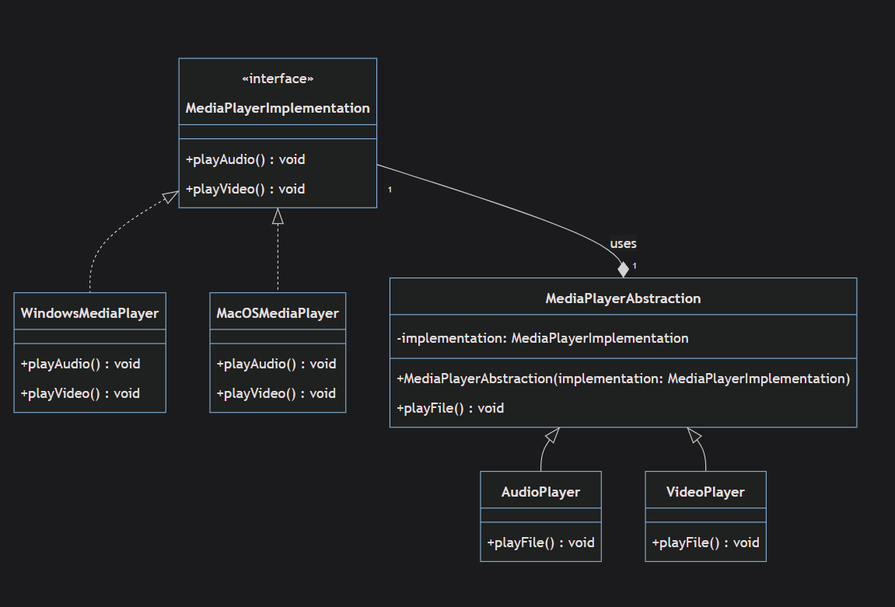
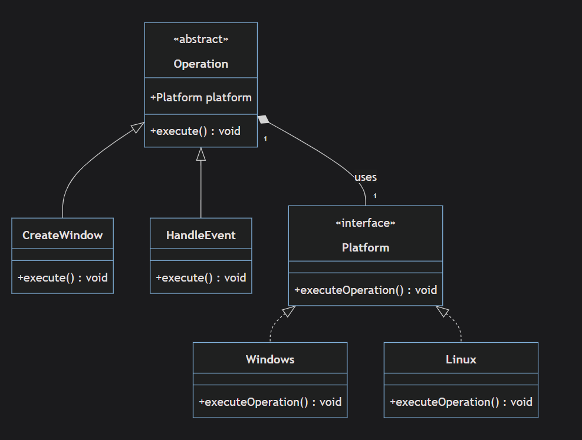
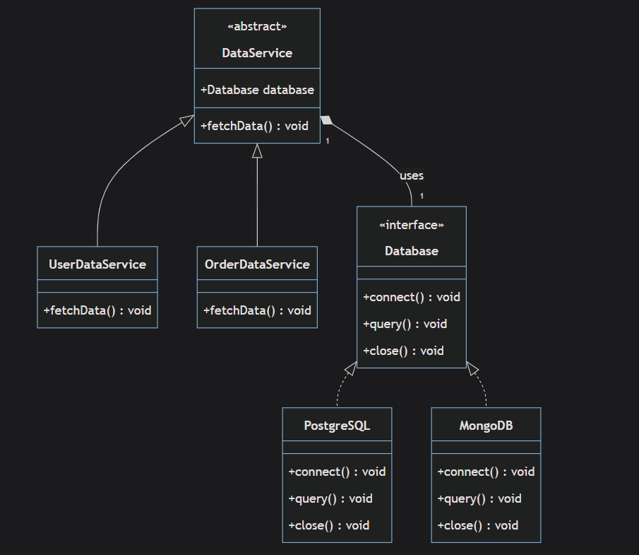
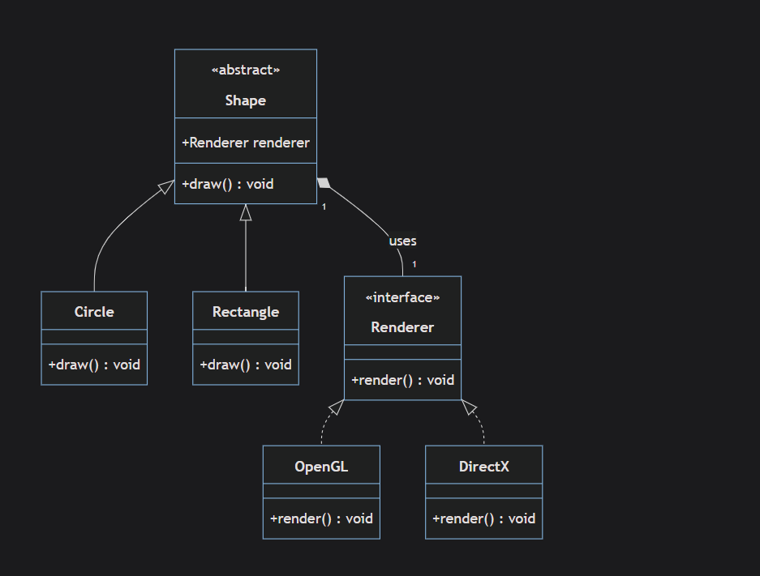

# Bridge

`Bridge is structural design pattern lets split a large class or a set of closely related classes into two separate hierarchies—abstraction and implementation—which can be developed independently of each other.`


## Implementation

- **Implementation**<interface>: _MediaPlayerImplementation_ this interface has the main functions that will be implemented

- **Concrete Implementation**<WindowsMediaPlayer>: classes which implement the interface

- **Abstraction**<MediaPlayerAbstraction>: implementation operator

- **Refined Abstractions**<AudioPlayer>: subclass that the special on certain operation

## Advantage

1- Decoupling Implementation form abstraction

2- improve readability and maintainability

3- Runtime Binding

The Bridge pattern enables changing the implementation at runtime. In the client code, you can easily switch from using a PostgreSQLDatabase to a MongoDBDatabase just by instantiating a new ClientDatabaseService with a different Database object.

```typeScript
let databaseService = new ClientDatabaseService(new PostgreSQLDatabase());
databaseService.fetchData("SELECT * FROM users;"); // use PostgreSQL database

databaseService = new ClientDatabaseService(new MongoDBDatabase());
databaseService.fetchData("db.users.find({})"); // use MongoDB database
```

## Disadvantages

1- Over-engineering

2-Design Difficulty
`Deciding on the correct abstraction and future changes can be challenging`

3- performance overhead

`Every time you call a method, it often goes through an abstraction object, which then delegates to an implementation object.`

4- Development and Maintenance Costs
`Introducing the Bridge pattern requires refactoring the existing codebase which comes with development costs.`

## Use Cases

1- Cross-platform Apps


2- Different Database Systems


3-Graphic Library

