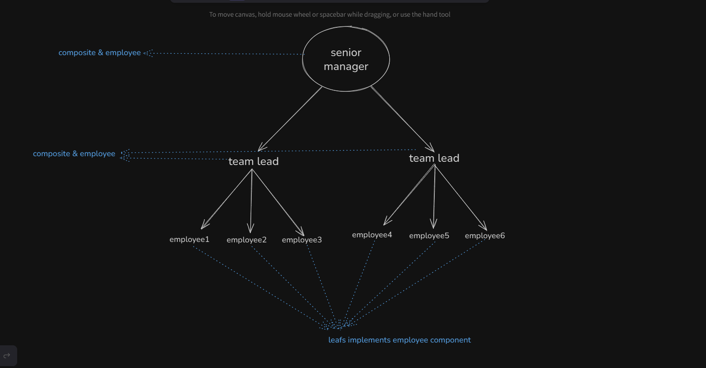

# composition is structural design pattern

- component : interface this has the main methods that each child perform

- leaf : this the schema of a child (element) , this has no children

- composite : this is the parent of a composition , it implements component interface so it's basically has all methods of children PLUS it has additional methods that performs on the whole composite
  

## Uses

- when you have parent object that has nested objects

- when you want to perform a certain tasks on many objects as one individual object
