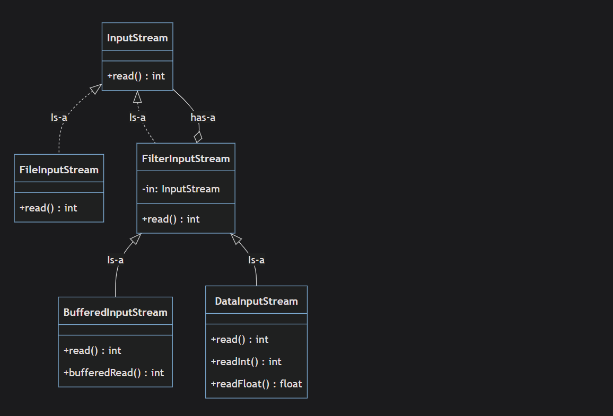

# Decorator

decorator is structural and behavioral design pattern , it uses to add or manipulate existing objects

it consist of:

**Component**: base interface or abstract class that has the methods of base object

**Component Concrete**:the class the implements the _component_

**Decorator**: abstract class of Decorator

**Decorator Concrete**: class the extends the Decorator

## Use Cases

- moderating or adding responsibility to existing object

- when extending class is not an option

- when you have so many combinations and extending class would not be best solution

- extendable systems , for example the coffee if you want to have seasonal decorators

## Advantages

1-adhere Single Responsibility Principle

2- adding or remove functions at run time

```
Imagine a coffee shop:
You order a simple coffee.
At the counter, you decide to add milk.
Then you add sugar.
Next time, you might add cream instead.
You don't need a separate "MilkSugarCoffee" class.
You just decorate your coffee with what you want at runtime.
```

3- code reusability and reduce redundancy

4- took advantage over subclasses for extending functionality
_With the Decorator Pattern, you can add new behaviors to objects without affecting the behaviors of other objects of the same class. This is more flexible than subclassing, which extends behavior at the class level, not the object level._

```typeScript
//without decorator

class BaseServer {
  handleRequest(request: any): void {
    console.log("handle server request", request);
  }
}

class LoggingServer extends BaseServer {
  handleRequest(request: any): void {
    console.log("logging Request", request);
    super.handleRequest(request);
  }
}

class AuthServer extends BaseServer {
  handleRequest(request: any): void {
    if (request.isAuthenticated) {
      console.log("Request Authenticated");
      super.handleRequest(request);
    } else {
      console.log("Request is NOT Authenticated");
    }
  }
}

// If you want both logging and authentication, you need a new class:
class AuthLoggingServer extends BaseServer {
  handleRequest(request: any): void {
    if (request.isAuthenticated) {
      console.log("Request Authenticated");
      console.log("logging Request", request);
      super.handleRequest(request);
    } else {
      console.log("Request is NOT Authenticated");
    }
  }
}

// Usage: must pick a fixed class
const request = { body: "Hasan", isAuthenticated: true };

const server1 = new LoggingServer();
server1.handleRequest(request);

const server2 = new AuthServer();
server2.handleRequest(request);

const server3 = new AuthLoggingServer();
server3.handleRequest(request);

export {};

```

## DisAdvantages

1- ordering of decorators implementations is very importance , hence any change of the order can result unexpected output

2- many small objects are results from decorators , which make the debugging is bit hard and functionalities is scattered throw decorators

3- component interface comparability , this means that adding or removing method from component interface can lead to big impact on whole decorator design pattern

## Use Cases

1- java I/O Classes


Decorate the _FileInputStream_ to add more features (BufferedInputStream) , (DataInputStream)
